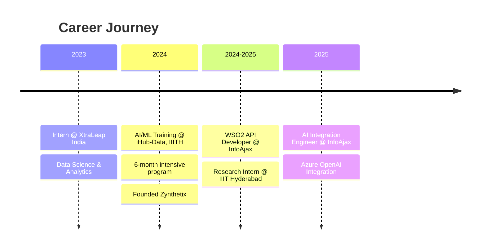

<div align="center">

<!-- Animated Gradient Header -->


<br/>

<!-- Animated Badges -->
<a href="https://karthik.zynthetix.in/">
  
</a>
<a href="https://blogs.zynthetix.in/">
  
</a>
<a href="https://linkedin.com/in/gruhesh-sri-sai-karthik-kurra-178249227">
  
</a>
<a href="mailto:gruheshkurra2@gmail.com">
  
</a>

<br/><br/>

<!-- Typing SVG -->
<a href="https://git.io/typing-svg">
  
</a>

<br/>

<!-- Animated Stats Cards -->


</div>

<br/>


## 💫 About Me

```typescript
const karthik = {
  role: "AI Integration Engineer @ InfoAjax | Founder @ Zynthetix",
  location: "Hyderabad, India 🇮🇳",
  education: "B.Tech CSE @ KL University (9.72 CGPA)",

  currentFocus: [
    "🤖 AI-driven integration frameworks with Azure OpenAI",
    "🔬 Layout-Preserving Document Translation @ IIIT Hyderabad",
    "📝 ML algorithms from scratch blog series",
  ],

  expertise: {
    ai: ["LLMs", "Transformers", "Vision Transformers", "RAG", "Fine-tuning"],
    mobile: ["SwiftUI", "Core ML", "On-Device AI"],
    research: ["Neural Compression", "Deepfake Detection", "NLP"],
  },

  achievements: {
    publications: 6,
    projects: 44,
    certifications: 16,
    compression: "40× via BIE encoding",
  },
};
```


## 🚀 What I'm Building

<table>
<tr>
<td width="33%" align="center">

### 🤖 AI Integration

**InfoAjax Consulting**

Agent-based system using Azure OpenAI for automated schema mapping & intelligent orchestration

`React 18` `FastAPI` `WebSocket`

</td>
<td width="33%" align="center">

### 🔬 IIIT Hyderabad

**Layout-Preserving Translation**

Vision Transformer-based document analysis with **92% accuracy**

`ViT` `Tesseract OCR` `FastAPI`

</td>
<td width="33%" align="center">

### � DeepGuard iOS

**On-Device Detection**

Privacy-first deepfake detection with **98.62% accuracy** & <500ms inference

`Swift` `Core ML` `EfficientNet`

</td>
</tr>
</table>


## 📚 Research Publications

<div align="center">

| 📄 Paper                                                                                                                     | �️ Venue          | 📅 Year |
| :--------------------------------------------------------------------------------------------------------------------------- | :---------------- | :------ |
| **Morphology-Aware Nested Character Embeddings for Word Representation**                                                     | IEEE ICCCMLA 2025 | 2025    |
| **[BIE: Bit-Index Encoding for Neural Network Weight Compression](https://zenodo.org/records/17217218)**                     | Zenodo            | 2025    |
| **[Hybrid RAG-Enhanced Deepfake Detection](https://zenodo.org/records/16732053)**                                            | Zenodo            | 2024    |
| **[Dynamic Auto-Finetuning of LLMs via Confidence-Driven Knowledge Integration](https://ijnrd.org/papers/IJNRD2411189.pdf)** | IJNRD             | 2024    |
| **[Global Remote RAM Sharing: A Novel Distributed Computing Framework](https://ijnrd.org/papers/IJNRD2412277.pdf)**          | IJNRD             | 2024    |
| **[Voice-Activated AI for Seamless Computer Interaction](https://ijnrd.org/papers/IJNRD2501080.pdf)**                        | IJNRD             | 2025    |

</div>


## 🛠️ Tech Arsenal

<div align="center">

### 🧠 AI & Machine Learning


### 💻 Languages & Frameworks


### 📱 iOS Development


### ☁️ Cloud & DevOps


</div>


## 🌟 Featured Projects

<div align="center">

[](https://github.com/GruheshKurra/deepguard-detection)
[](https://github.com/GruheshKurra/GPT-2-from-Scratch)
[](https://github.com/GruheshKurra/bit-index-encoding-research-)
[](https://github.com/GruheshKurra/TransformersFromScratch)

</div>

<details>
<summary><b>📁 View All 44+ Projects</b></summary>
<br/>

### 🧠 LLM & Transformer Projects

| Project                                                                              | Description                                | Highlight                      |
| ------------------------------------------------------------------------------------ | ------------------------------------------ | ------------------------------ |
| [GPT-2 from Scratch](https://github.com/GruheshKurra/GPT-2-from-Scratch)             | Complete 124M parameter implementation     | Built transformer from scratch |
| [Transformers from Scratch](https://github.com/GruheshKurra/TransformersFromScratch) | "Attention Is All You Need" implementation | 85%+ accuracy                  |
| [NL2SQL Generator](https://github.com/GruheshKurra/nl2sql-pretrained)                | Natural Language to SQL                    | Perplexity: 1.42               |
| [Attention Mechanisms](https://github.com/GruheshKurra/AttentionMechanisms)          | Multi-head attention educational           | 96%+ accuracy                  |

### 🎨 Generative AI

| Project                                                                       | Description                  | Highlight               |
| ----------------------------------------------------------------------------- | ---------------------------- | ----------------------- |
| [Diffusion Models](https://github.com/GruheshKurra/DiffusionModelFromScratch) | Complete DDPM implementation | ~130K params            |
| [GAN Implementation](https://github.com/GruheshKurra/GAN_Implementation)      | MNIST generation             | Multiple training modes |
| [VAE Implementation](https://github.com/GruheshKurra/VariationalAutoencoders) | Latent space analysis        | Clear reconstructions   |

### 🔬 Research & Analysis

| Project                                                                                       | Description           | Highlight       |
| --------------------------------------------------------------------------------------------- | --------------------- | --------------- |
| [Clinical Trial Analysis](https://github.com/GruheshKurra/Clinical-Trial-Similarity-Analysis) | PubMedBERT similarity | 99.5% accuracy  |
| [Graph Neural Networks](https://github.com/GruheshKurra/GraphNeuralNetworks-GNN-)             | GCN, GraphSAGE, GAT   | 81.9% accuracy  |
| [Dimensionality Reduction](https://github.com/GruheshKurra/dimensionality-reduction)          | PCA, t-SNE, UMAP      | Full comparison |

</details>


## 📝 ML From Scratch Blog

<div align="center">

I write comprehensive tutorials teaching ML algorithms from the ground up.

### **[🌐 Visit blogs.zynthetix.in](https://blogs.zynthetix.in/)**

</div>

| Algorithm                                                                          | Category                 | Algorithm                                                                     | Category                 |
| :--------------------------------------------------------------------------------- | :----------------------- | :---------------------------------------------------------------------------- | :----------------------- |
| [UMAP](https://github.com/GruheshKurra/umap-dimensionality-reduction)              | Dimensionality Reduction | [t-SNE](https://github.com/GruheshKurra/tsne-from-scratch)                    | Dimensionality Reduction |
| [Hierarchical Clustering](https://github.com/GruheshKurra/hierarchical-clustering) | Clustering               | [DBSCAN](https://github.com/GruheshKurra/dbscan-clustering)                   | Clustering               |
| [K-Means](https://github.com/GruheshKurra/k-means-clustering)                      | Clustering               | [KNN](https://github.com/GruheshKurra/knn-implementation)                     | Classification           |
| [SVM](https://github.com/GruheshKurra/SVM-Implementation-From-Scratch)             | Classification           | [Naive Bayes](https://github.com/GruheshKurra/naive-bayes-implementation)     | Classification           |
| [Random Forest](https://github.com/GruheshKurra/random-forest-from-scratch)        | Ensemble                 | [Decision Trees](https://github.com/GruheshKurra/decision-trees-from-scratch) | Classification           |
| [Logistic Regression](https://github.com/GruheshKurra/logistic-regression-impl)    | Classification           | [Linear Regression](https://github.com/GruheshKurra/linear-regression-impl)   | Regression               |


## 💼 Experience Timeline




## 🏆 Certifications

<div align="center">

| Certification           | Provider            | Certification            | Provider     |
| :---------------------- | :------------------ | :----------------------- | :----------- |
| TensorFlow Developer    | Google              | AWS Cloud Practitioner   | Amazon       |
| AWS Solutions Architect | Amazon              | OCI Architect Associate  | Oracle       |
| Advanced Automation Pro | Automation Anywhere | Enterprise App Developer | Red Hat      |
| Build LLMs from Scratch | Visuara             | WSO2 MI Developer        | WSO2         |
| WSO2 MI Practitioner    | WSO2                | HuggingFace MCP          | Hugging Face |
| 6-Month AI Training     | IIIT Hyderabad      | Google GDG               | Google       |

</div>


## 📊 GitHub Analytics

<div align="center">


<br/>


<br/><br/>


<br/>


</div>


## 🎯 Key Achievements

<div align="center">

| 🏆 Metric                | 📈 Value            | 🏆 Metric            | 📈 Value           |
| :----------------------- | :------------------ | :------------------- | :----------------- |
| **GPT-2 Parameters**     | 124M (from scratch) | **DeepGuard iOS**    | 98.62% accuracy    |
| **BIE Compression**      | 40× with MSE <10⁻⁶  | **Layout Detection** | 92% accuracy       |
| **Research Papers**      | 6+ Published        | **Certifications**   | 16+                |
| **Open Source Projects** | 44+                 | **Blog Tutorials**   | 12+                |
| **PII Detection**        | 98.5% (Zynthetix)   | **German NER**       | +58.3% improvement |

</div>


## 🤝 Let's Connect

<div align="center">

**I'm always excited to collaborate on AI/ML research, transformer architectures, iOS AI apps, and innovative AI applications!**

<br/>

[](https://karthik.zynthetix.in/)
[](https://blogs.zynthetix.in/)
[](https://linkedin.com/in/gruhesh-sri-sai-karthik-kurra-178249227)
[](mailto:gruheshkurra2@gmail.com)
[](https://github.com/GruheshKurra)
[](https://huggingface.co/karthik-2905)

<br/>

### 🔬 Open to Collaborate On

`🧠 Transformer Research` `🤖 LLM Development` `📱 iOS AI Apps` `👁️ Vision-Language Models` `🔒 Privacy-Preserving AI` `🔬 Neural Compression`

</div>

<br/>


<div align="center">
  
**"Building the future of AI, one transformer at a time"** ✨

<sub>Made with ❤️ by Karthik Kurra</sub>

</div>
