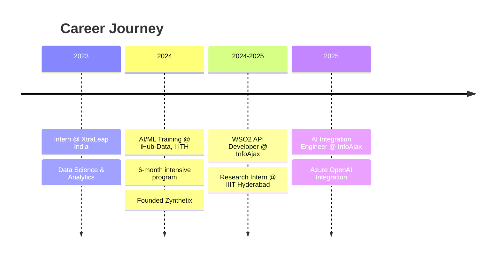

<div align="center">

<!-- Animated Gradient Header -->


<br/>

<!-- Animated Badges -->
<a href="https://karthik.zynthetix.in/">
  
</a>
<a href="https://blogs.zynthetix.in/">
  
</a>
<a href="https://linkedin.com/in/gruhesh-sri-sai-karthik-kurra-178249227">
  
</a>
<a href="mailto:gruheshkurra2@gmail.com">
  
</a>
<a href="https://huggingface.co/karthik-2905">
  
</a>

<br/><br/>

<!-- Typing SVG -->
<a href="https://git.io/typing-svg">
  
</a>

<br/>

<!-- Animated Stats Cards -->


</div>

<br/>


## 💫 About Me

```typescript
const karthik = {
  role: "AI Integration Engineer @ InfoAjax | Founder @ Zynthetix",
  location: "Hyderabad, India 🇮🇳",
  education: "B.Tech CSE @ KL University (9.72 CGPA)",

  currentFocus: [
    "🤖 AI-driven integration frameworks with Azure OpenAI",
    "🔬 Layout-Preserving Document Translation @ IIIT Hyderabad",
    "📝 ML algorithms from scratch blog series",
  ],

  expertise: {
    ai: ["LLMs", "Transformers", "Vision Transformers", "RAG", "Fine-tuning"],
    mobile: ["SwiftUI", "Core ML", "On-Device AI"],
    research: ["Neural Compression", "Deepfake Detection", "NLP"],
  },

  achievements: {
    publications: 6,
    projects: 50,
    certifications: 16,
    compression: "40× via BIE encoding",
  },
};
```


## 🚀 What I'm Building

<table>
<tr>
<td width="25%" align="center">

### 🤖 AI Integration

**InfoAjax Consulting**

Agent-based system using Azure OpenAI for automated schema mapping & intelligent orchestration

`React 18` `FastAPI` `WebSocket`

</td>
<td width="25%" align="center">

### 🔬 IIIT Hyderabad

**Layout-Preserving Translation**

Vision Transformer-based document analysis with **92% accuracy**

`ViT` `Tesseract OCR` `FastAPI`

</td>
<td width="25%" align="center">

### 🛡️ DeepGuard iOS

**On-Device Detection**

Privacy-first deepfake detection with **98.62% accuracy** & <500ms inference

`Swift` `Core ML` `EfficientNet`

</td>
<td width="25%" align="center">

### 🏥 Medical AI Dashboard

**Healthcare AI Platform**

Pregnancy risk prediction **(100% acc.)** & fetal ultrasound classification **(91.69% acc.)**

`PyTorch` `ViT` `React` `Flask`

</td>
</tr>
</table>


## 📚 Research Publications

<div align="center">

<a href="https://zenodo.org/search?q=karthik+kurra&l=list&p=1&s=bestmatch&sort=bestmatch">
  
</a>
<a href="https://ijnrd.org/viewpaperforall.php?paper=IJNRD2411189">
  
</a>

<br/><br/>

| 📄 Paper | 🏛️ Venue | 📅 Year |
| :--- | :--- | :--- |
| **[Morphology-Aware Nested Character Embeddings for Word Representation](https://ieeexplore.ieee.org/search/searchresult.jsp?queryText=Morphology-Aware+Nested+Character+Embeddings)** | IEEE ICCCMLA 2025 | 2025 |
| **[BIE: Bit-Index Encoding for Neural Network Weight Compression](https://zenodo.org/records/17217218)** | Zenodo | 2025 |
| **[Hybrid RAG-Enhanced Deepfake Detection](https://zenodo.org/records/16732053)** | Zenodo | 2024 |
| **[Dynamic Auto-Finetuning of LLMs via Confidence-Driven Knowledge Integration](https://ijnrd.org/papers/IJNRD2411189.pdf)** | IJNRD | 2024 |
| **[Global Remote RAM Sharing: A Novel Distributed Computing Framework](https://ijnrd.org/papers/IJNRD2412277.pdf)** | IJNRD | 2024 |
| **[Voice-Activated AI for Seamless Computer Interaction](https://ijnrd.org/papers/IJNRD2501080.pdf)** | IJNRD | 2025 |

</div>


## 🛠️ Tech Arsenal

<div align="center">

### 🧠 AI & Machine Learning


### 💻 Languages & Frameworks


### 📱 iOS Development


### ☁️ Cloud & DevOps


</div>


## 🌟 Featured Projects

<div align="center">

<a href="https://github.com/GruheshKurra/nl2sql-pretrained">
  
</a>
<a href="https://github.com/GruheshKurra/FirstGPTFromScratch">
  
</a>
<a href="https://github.com/GruheshKurra/radar_deepfake">
  
</a>
<a href="https://github.com/GruheshKurra/healthcareAI">
  
</a>

</div>

<details>
<summary><b>📁 View All 50+ Projects</b></summary>
<br/>

### 🧠 LLM & Transformer Projects

| Project | Description | Highlight |
| :--- | :--- | :--- |
| [FirstGPTFromScratch](https://github.com/GruheshKurra/FirstGPTFromScratch) | Complete 124M parameter implementation | Built transformer from scratch |
| [Transformers from Scratch](https://github.com/GruheshKurra/TransformersFromScratch) | "Attention Is All You Need" implementation | 85%+ accuracy |
| [NL2SQL Generator](https://github.com/GruheshKurra/nl2sql-pretrained) | Natural Language to SQL | Perplexity: 1.42 |
| [Attention Mechanisms](https://github.com/GruheshKurra/AttentionMechanisms) | Multi-head attention educational | 96%+ accuracy |

### 🎨 Generative AI

| Project | Description | Highlight |
| :--- | :--- | :--- |
| [Diffusion Models](https://github.com/GruheshKurra/DiffusionModelFromScratch) | Complete DDPM implementation | ~130K params |
| [GAN Implementation](https://github.com/GruheshKurra/GAN_Implementation) | MNIST generation | Multiple training modes |
| [VAE Implementation](https://github.com/GruheshKurra/VariationalAutoencoders) | Latent space analysis | Clear reconstructions |

### 🔬 Research & Analysis

| Project | Description | Highlight |
| :--- | :--- | :--- |
| [RADAR Deepfake Detection](https://github.com/GruheshKurra/radar_deepfake) | Dual-module deepfake detection with iterative evidence refinement | 95.6% AUC, 90.1% accuracy |
| [Medical AI Dashboard](https://github.com/GruheshKurra/healthcareAI) | Pregnancy risk + fetal ultrasound classification | 100% / 91.69% accuracy |
| [Clinical Trial Analysis](https://github.com/GruheshKurra/Clinical-Trial-Similarity-Analysis) | PubMedBERT similarity | 99.5% accuracy |
| [Graph Neural Networks](https://github.com/GruheshKurra/GraphNeuralNetworks-GNN-) | GCN, GraphSAGE, GAT | 81.9% accuracy |
| [Dimensionality Reduction](https://github.com/GruheshKurra/dimensionality-reduction) | PCA, t-SNE, UMAP | Full comparison |

### 🌾 Applied AI

| Project | Description | Highlight |
| :--- | :--- | :--- |
| [FarmCare](https://github.com/GruheshKurra/Farmcare) | AI-powered farm management: plant disease, pest & soil analysis | Multi-language, Supabase backend |

</details>


## 🤗 HuggingFace Models & Spaces

<div align="center">

<a href="https://huggingface.co/karthik-2905">
  
</a>

<br/><br/>

Explore fine-tuned models, datasets, and interactive demos built for real-world AI tasks.

| 🤖 Area | 🔗 Explore |
| :--- | :--- |
| Fine-tuned LLMs & NLP Models | [huggingface.co/karthik-2905](https://huggingface.co/karthik-2905?tab=models) |
| Interactive AI Spaces & Demos | [huggingface.co/karthik-2905](https://huggingface.co/karthik-2905?tab=spaces) |

</div>


## 📝 ML From Scratch Blog

<div align="center">

I write comprehensive tutorials teaching ML algorithms from the ground up — math, intuition, and full Python implementations.

### **[🌐 Visit blogs.zynthetix.in](https://blogs.zynthetix.in/)**

</div>

| 📘 Algorithm | 🏷️ Category | 🔗 Code |
| :--- | :--- | :--- |
| UMAP | Dimensionality Reduction | [GitHub](https://github.com/GruheshKurra/umap-dimensionality-reduction) |
| t-SNE | Dimensionality Reduction | [GitHub](https://github.com/GruheshKurra/tsne-from-scratch) |
| Hierarchical Clustering | Clustering | [GitHub](https://github.com/GruheshKurra/hierarchical-clustering) |
| DBSCAN | Clustering | [GitHub](https://github.com/GruheshKurra/dbscan-clustering) |
| K-Means | Clustering | [GitHub](https://github.com/GruheshKurra/k-means-clustering) |
| KNN | Classification | [GitHub](https://github.com/GruheshKurra/knn-implementation) |
| SVM | Classification | [GitHub](https://github.com/GruheshKurra/SVM-Implementation-From-Scratch) |
| Naive Bayes | Classification | [GitHub](https://github.com/GruheshKurra/naive-bayes-implementation) |
| Random Forest | Ensemble | [GitHub](https://github.com/GruheshKurra/random-forest-from-scratch) |
| Decision Trees | Classification | [GitHub](https://github.com/GruheshKurra/decision-trees-from-scratch) |
| Logistic Regression | Classification | [GitHub](https://github.com/GruheshKurra/logistic-regression-impl) |
| Linear Regression | Regression | [GitHub](https://github.com/GruheshKurra/linear-regression-impl) |


## 💼 Experience Timeline


```mermaid
timeline
    title Career Journey
    2023 : Intern @ XtraLeap India
         : Data Science & Analytics
    2024 : AI/ML Training @ iHub-Data, IIITH
         : 6-month intensive program
         : Founded Zynthetix
    2024-2025 : WSO2 API Developer @ InfoAjax
              : Research Intern @ IIIT Hyderabad
    2025 : AI Integration Engineer @ InfoAjax
         : Azure OpenAI Integration
```


## 🏆 Certifications

<div align="center">

| Certification | Provider | Certification | Provider |
| :--- | :--- | :--- | :--- |
| TensorFlow Developer | Google | AWS Cloud Practitioner | Amazon |
| AWS Solutions Architect | Amazon | OCI Architect Associate | Oracle |
| Advanced Automation Pro | Automation Anywhere | Enterprise App Developer | Red Hat |
| Build LLMs from Scratch | Visuara | WSO2 MI Developer | WSO2 |
| WSO2 MI Practitioner | WSO2 | HuggingFace MCP | Hugging Face |
| 6-Month AI/ML Training | IIIT Hyderabad | Google GDG | Google |
| Azure AI Fundamentals | Microsoft | Azure Data Fundamentals | Microsoft |
| Deep Learning Specialization | DeepLearning.AI | Machine Learning Specialization | DeepLearning.AI |

</div>


## 📊 GitHub Analytics

<div align="center">

<a href="https://github.com/GruheshKurra">
  
</a>
<a href="https://github.com/GruheshKurra">
  
</a>

<br/>

<a href="https://github.com/GruheshKurra">
  
</a>

<br/>

<a href="https://github.com/GruheshKurra">
  
</a>

<br/>

<a href="https://github.com/GruheshKurra">
  
</a>

<br/>

<!-- Contribution Summary -->
<a href="https://github.com/GruheshKurra">
  
</a>

</div>


## 🎯 Key Achievements

<div align="center">

| 🏆 Metric | 📈 Value | 🏆 Metric | 📈 Value |
| :--- | :--- | :--- | :--- |
| **GPT-2 Parameters** | 124M (from scratch) | **DeepGuard iOS** | 98.62% accuracy |
| **BIE Compression** | 40× with MSE <10⁻⁶ | **Layout Detection** | 92% accuracy |
| **Research Papers** | 6+ Published | **Certifications** | 16+ |
| **Open Source Projects** | 50+ | **Blog Tutorials** | 12+ |
| **PII Detection** | 98.5% (Zynthetix) | **RADAR Deepfake** | 95.6% AUC |

</div>


## 🔭 What's Next

<div align="center">

| 🎯 Goal | 📋 Status |
| :--- | :--- |
| Release **DeepGuard** iOS app on the App Store | 🔄 In Progress |
| Release **DeepCut** — AI-powered video cut detection iOS app | 🔄 In Progress |
| Release **MedVault** — Personal health records & AI insights iOS app | 🔄 In Progress |
| Release **VoiceScribe** — Native macOS voice-to-text app powered by on-device AI | 🔄 In Progress |
| Release **TerminalVibe** — macOS terminal AI coding assistant (vibe-coding meets CLI) | 🔄 In Progress |
| On an epic AI mastery journey — systematically working through **1,300+ curated topics** spanning every domain of AI & ML | 🔄 In Progress |
| Expand ML From Scratch blog to 20+ deep-dive tutorials | 📅 Planned |

</div>


## 💡 Fun Facts

<div align="center">

- 🧠 Built a **GPT-2 equivalent (124M parameters)** entirely from scratch — no shortcuts
- 🗜️ Achieved **40× neural network compression** using my own BIE encoding with MSE < 10⁻⁶
- 📱 My iOS app detects deepfakes **in under 500ms on-device**, with zero data sent to a server
- 🌍 My research spans multiple publication venues — IEEE, Zenodo, and IJNRD
- ✍️ I write every blog post with full mathematical derivations **and** working Python code
- 🚀 Founded **Zynthetix** while still in my 3rd year of undergrad
- 📚 On a relentless mission to master AI end-to-end — working through **1,300+ curated topics** from linear algebra and probability all the way to cutting-edge research

</div>


## 🤝 Let's Connect

<div align="center">

**I'm always excited to collaborate on AI/ML research, transformer architectures, iOS AI apps, and innovative AI applications!**

<br/>

[](https://karthik.zynthetix.in/)
[](https://blogs.zynthetix.in/)
[](https://linkedin.com/in/gruhesh-sri-sai-karthik-kurra-178249227)
[](mailto:gruheshkurra2@gmail.com)
[](https://github.com/GruheshKurra)
[](https://huggingface.co/karthik-2905)

<br/>

### 🔬 Open to Collaborate On

`🧠 Transformer Research` `🤖 LLM Development` `📱 iOS AI Apps` `👁️ Vision-Language Models` `🔒 Privacy-Preserving AI` `🔬 Neural Compression`

</div>

<br/>


<div align="center">
  
**"Building the future of AI, one transformer at a time"** ✨

<sub>Made with ❤️ by Karthik Kurra</sub>

</div>
