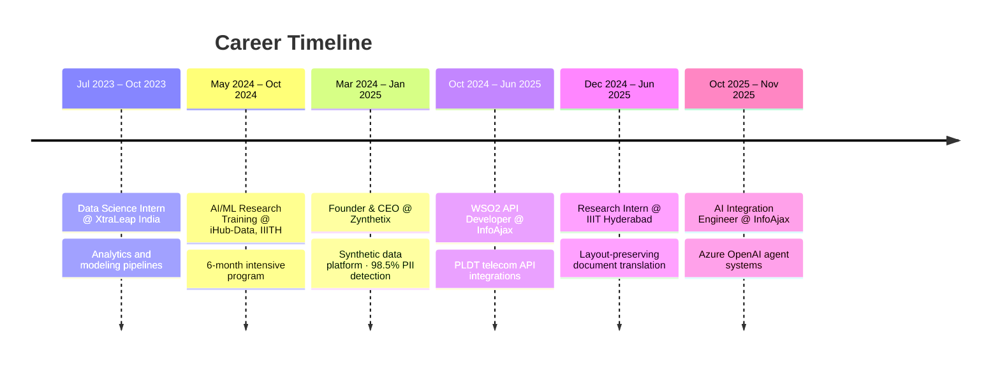

 

  

 

---

## About Me

I build AI systems end-to-end — from implementing attention mechanisms from scratch to deploying deepfake detectors that run entirely on-device in under 500ms. Currently focused on independent AI/ML research and developing **Zynthetix**, my synthetic data platform. I completed my **B.Tech CSE at KL University with a 9.72 CGPA**, published **6 papers** across IEEE, IJNRD, and Zenodo, and write a blog where I implement ML algorithms from the math up — no black boxes. `sleep: insufficient`.

---

## By the Numbers

| | Metric | Value |
|:---:|:---|:---:|
| 📄 | Research papers published (IEEE, IJNRD, Zenodo) | **6+** |
| 🗂️ | Open source projects | **50+** |
| 🏅 | Professional certifications | **16+** |
| 🧠 | GPT-2 parameters implemented from scratch | **124M** |
| 🗜️ | Neural weight compression ratio (BIE), MSE < 10⁻⁶ | **40×** |
| 📱 | DeepGuard iOS deepfake detection accuracy | **98.62%** |
| 🏥 | Clinical trial similarity accuracy (PubMedBERT) | **99.5%** |
| 🇩🇪 | German NER improvement with morphology-aware embeddings | **+58.3%** |

---

## Research Publications

| Paper | Key Result | Venue | Year |
|:---|:---|:---|:---|
| **Morphology-Aware Nested Character Embeddings for Word Representation** | +2–8% English NER, +58.3% German NER over baselines | IEEE ICCCMLA | 2025 |
| **[BIE: Bit-Index Encoding for Neural Network Weight Compression](https://zenodo.org/records/17217218)** | 40× compression with MSE < 10⁻⁶ — no meaningful accuracy loss | Zenodo | 2025 |
| **[Hybrid RAG-Enhanced Deepfake Detection](https://zenodo.org/records/16732053)** | RAG-augmented detection pipeline combining retrieval with visual classification | Zenodo | 2024 |
| **[Dynamic Auto-Finetuning of LLMs via Confidence-Driven Knowledge Integration](https://ijnrd.org/papers/IJNRD2411189.pdf)** | Confidence score triggers selective fine-tuning without full retraining | IJNRD | 2024 |
| **[Global Remote RAM Sharing: A Novel Distributed Computing Framework](https://ijnrd.org/papers/IJNRD2412277.pdf)** | Distributed memory pooling across nodes for compute-constrained environments | IJNRD | 2024 |
| **[Voice-Activated AI for Computer Interaction](https://ijnrd.org/papers/IJNRD2501080.pdf)** | End-to-end voice command system with intent classification and system control | IJNRD | 2025 |

---

## Featured Projects

<b>Explore all projects by category</b>

 

### From Scratch Implementations

| Project | Description | Highlight |
|:---|:---|:---|
| [FirstGPTFromScratch](https://github.com/GruheshKurra/FirstGPTFromScratch) | Complete GPT-2 implementation from attention to generation | 124M parameters |
| [TransformersFromScratch](https://github.com/GruheshKurra/TransformersFromScratch) | "Attention Is All You Need" replicated end-to-end | 85%+ accuracy |
| [AttentionMechanisms](https://github.com/GruheshKurra/AttentionMechanisms) | Multi-head attention deep-dive with visualizations | 96%+ accuracy |
| [DiffusionModelFromScratch](https://github.com/GruheshKurra/DiffusionModelFromScratch) | DDPM from math to generated images | ~130K params |
| [GAN_Implementation](https://github.com/GruheshKurra/GAN_Implementation) | GAN trained on MNIST with multiple architectures | Full pipeline |
| [VariationalAutoencoders](https://github.com/GruheshKurra/VariationalAutoencoders) | VAE with latent space visualization and analysis | Full analysis |
| [nl2sql-pretrained](https://github.com/GruheshKurra/nl2sql-pretrained) | Natural language to SQL query translation | Perplexity 1.42 |
| [SVM-Implementation-From-Scratch](https://github.com/GruheshKurra/SVM-Implementation-From-Scratch) | SVM with SMO optimizer, kernel tricks, multi-class | Hard/Soft/Kernel SVM |
| [random-forest-from-scratch](https://github.com/GruheshKurra/random-forest-from-scratch) | Random Forest with bootstrapping and feature importance | No sklearn |
| [decision-trees-from-scratch](https://github.com/GruheshKurra/decision-trees-from-scratch) | ID3/CART decision tree with information gain | From math up |
| [logistic-regression-impl](https://github.com/GruheshKurra/logistic-regression-impl) | Logistic regression with gradient descent | From math up |
| [linear-regression-impl](https://github.com/GruheshKurra/linear-regression-impl) | Linear regression with normal equations | From math up |
| [knn-implementation](https://github.com/GruheshKurra/knn-implementation) | KNN with configurable distance metrics | Clean implementation |
| [naive-bayes-implementation](https://github.com/GruheshKurra/naive-bayes-implementation) | Gaussian and Multinomial Naive Bayes | From scratch |

### Research & Advanced ML

| Project | Description | Highlight |
|:---|:---|:---|
| [bit-index-encoding-research-](https://github.com/GruheshKurra/bit-index-encoding-research-) | BIE neural weight compression | 40× compression |
| [radar_deepfake](https://github.com/GruheshKurra/radar_deepfake) | Hybrid RAG deepfake detection | Best Paper, IEEE ICACCS |
| [Clinical-Trial-Similarity-Analysis](https://github.com/GruheshKurra/Clinical-Trial-Similarity-Analysis) | PubMedBERT clinical NLP pipeline | 99.5% accuracy |
| [GraphNeuralNetworks-GNN-](https://github.com/GruheshKurra/GraphNeuralNetworks-GNN-) | GCN, GraphSAGE, GAT implementations | 81.9% accuracy |
| [Bayesian-Networks](https://github.com/GruheshKurra/Bayesian-Networks) | Probabilistic graphical models | Inference & learning |
| [MonteCarloMethods](https://github.com/GruheshKurra/MonteCarloMethods) | Monte Carlo sampling and estimation | From scratch |
| [TemporalDifferenceLearning](https://github.com/GruheshKurra/TemporalDifferenceLearning) | TD learning algorithms | Tabular to deep |
| [SequenceModeling](https://github.com/GruheshKurra/SequenceModeling) | RNN, LSTM, GRU implementations | From scratch |
| [LLamaModel](https://github.com/GruheshKurra/LLamaModel) | LLaMA architecture exploration | Research |
| [MANCE-NLP](https://github.com/GruheshKurra/MANCE-NLP) | Advanced NLP pipeline | Multi-task |
| [AnomalyDetection](https://github.com/GruheshKurra/AnomalyDetection) | Anomaly detection algorithms | Multiple methods |

### Dimensionality Reduction & Clustering

| Project | Description | Highlight |
|:---|:---|:---|
| [dimensionality-reduction](https://github.com/GruheshKurra/dimensionality-reduction) | PCA, t-SNE, UMAP comparison | Full benchmark |
| [umap-dimensionality-reduction](https://github.com/GruheshKurra/umap-dimensionality-reduction) | UMAP deep-dive implementation | Topology preservation |
| [tsne-from-scratch](https://github.com/GruheshKurra/tsne-from-scratch) | t-SNE from the ground up | From math up |
| [k-means-clustering](https://github.com/GruheshKurra/k-means-clustering) | K-Means from scratch with visualizations | Used in doc translation |
| [hierarchical-clustering](https://github.com/GruheshKurra/hierarchical-clustering) | Agglomerative clustering with dendrograms | Full analysis |
| [dbscan-clustering](https://github.com/GruheshKurra/dbscan-clustering) | DBSCAN with epsilon search | Noise handling |
| [ClusteringAlgorithms](https://github.com/GruheshKurra/ClusteringAlgorithms) | Comprehensive clustering suite | Multiple algorithms |

### Web, Mobile & Full Stack

| Project | Description | Stack |
|:---|:---|:---|
| [Deepguard](https://github.com/GruheshKurra/Deepguard) | Deepfake detection web platform | PyTorch, FastAPI, React |
| [MobileApp](https://github.com/GruheshKurra/MobileApp) | DeepGuard iOS native app — 98.62% accuracy, <500ms | Swift, Core ML, SwiftUI |
| [Zynthetix-SWE-Agent](https://github.com/GruheshKurra/Zynthetix-SWE-Agent) | Autonomous SWE agent — fixes GitHub issues, opens PRs | Python, GitHub Actions |
| [FastAPI-Blogpost-App](https://github.com/GruheshKurra/FastAPI-Blogpost-App) | Full-stack blog with FARM stack | FastAPI, React, MongoDB |
| [Ecommerce-java](https://github.com/GruheshKurra/Ecommerce-java) | Enterprise ecommerce platform | Java EE |

---

## Tech Stack

 

**AI / ML**

**Languages**

**Web & Mobile**

**Cloud & DevOps**

---

## GitHub Activity

  

  

---

## ML From Scratch Blog

Each post at [blogs.zynthetix.in](https://blogs.zynthetix.in/) starts from the math and ends with working code — no wrappers, no shortcuts, no "just call `fit()`".

| Algorithm | Category | Repo |
|:---|:---|:---|
| Linear Regression | Regression | [linear-regression-impl](https://github.com/GruheshKurra/linear-regression-impl) |
| Logistic Regression | Classification | [logistic-regression-impl](https://github.com/GruheshKurra/logistic-regression-impl) |
| K-Nearest Neighbors | Classification | [knn-implementation](https://github.com/GruheshKurra/knn-implementation) |
| Naive Bayes | Classification | [naive-bayes-implementation](https://github.com/GruheshKurra/naive-bayes-implementation) |
| Decision Trees | Classification | [decision-trees-from-scratch](https://github.com/GruheshKurra/decision-trees-from-scratch) |
| Random Forest | Ensemble | [random-forest-from-scratch](https://github.com/GruheshKurra/random-forest-from-scratch) |
| Support Vector Machine | Classification | [SVM-Implementation-From-Scratch](https://github.com/GruheshKurra/SVM-Implementation-From-Scratch) |
| K-Means Clustering | Clustering | [k-means-clustering](https://github.com/GruheshKurra/k-means-clustering) |
| DBSCAN | Clustering | [dbscan-clustering](https://github.com/GruheshKurra/dbscan-clustering) |
| Hierarchical Clustering | Clustering | [hierarchical-clustering](https://github.com/GruheshKurra/hierarchical-clustering) |
| t-SNE | Dimensionality Reduction | [dimensionality-reduction](https://github.com/GruheshKurra/dimensionality-reduction) |
| UMAP | Dimensionality Reduction | [umap-dimensionality-reduction](https://github.com/GruheshKurra/umap-dimensionality-reduction) |

---

## Career

```mermaid
timeline
    title Career Timeline
    Jul 2023 – Oct 2023 : Data Science Intern @ XtraLeap India
                        : Analytics and modeling pipelines
    May 2024 – Oct 2024 : AI/ML Research Training @ iHub-Data, IIITH
                        : 6-month intensive program
    Mar 2024 – Jan 2025 : Founder & CEO @ Zynthetix
                        : Synthetic data platform · 98.5% PII detection
    Oct 2024 – Jun 2025 : WSO2 API Developer @ InfoAjax
                        : PLDT telecom API integrations
    Dec 2024 – Jun 2025 : Research Intern @ IIIT Hyderabad
                        : Layout-preserving document translation
    Oct 2025 – Nov 2025 : AI Integration Engineer @ InfoAjax
                        : Azure OpenAI agent systems
```

---

## Certifications

<b>16+ Certifications</b>

 

| Certification | Provider |
|:---|:---|
| TensorFlow Developer | Google |
| AWS Cloud Practitioner | Amazon Web Services |
| AWS Solutions Architect | Amazon Web Services |
| OCI Architect Associate | Oracle |
| Advanced Automation Pro | Automation Anywhere |
| Enterprise App Developer | Red Hat |
| Build LLMs from Scratch | Visuara |
| WSO2 MI Developer | WSO2 |
| WSO2 MI Practitioner | WSO2 |
| HuggingFace MCP — Unit 1 | Hugging Face |
| HuggingFace MCP — Unit 3 | Hugging Face |
| 6-Month AI Training Program | IIIT Hyderabad |
| Google GDG | Google |
| Oracle Database | Oracle |
| SAC | SAP |
| StreetCause | StreetCause |

---

## Let's Connect

 

Open to collaborating on:

`Transformer Research` `LLM Development` `iOS On-Device AI` `Vision-Language Models` `Neural Compression` `Enterprise AI Integration`

 

**"From scratch — because that's the only way to actually understand it."**

