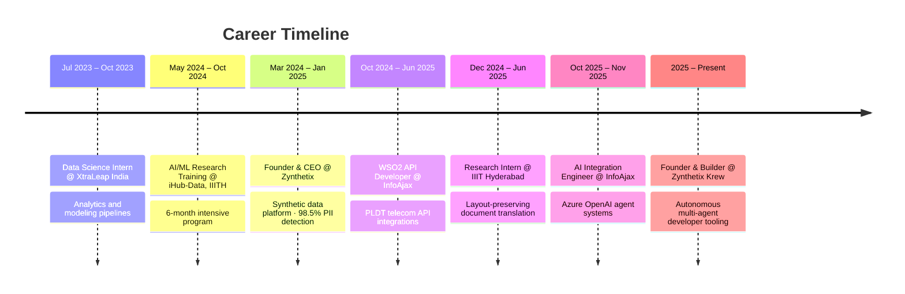

 

  

 

---

## About Me

I build AI systems end-to-end — from implementing attention mechanisms from scratch to deploying deepfake detectors that run entirely on-device in under 500ms. Currently building **Zynthetix Krew**, an autonomous multi-agent developer tool, while doing independent AI/ML research. Completed **B.Tech CSE at KL University with a 9.72 CGPA**, published **7 papers** across IEEE, IJNRD, and Zenodo. I write a blog where I implement ML algorithms from the math up — no black boxes. `sleep: insufficient`.

---

## By the Numbers

| | Metric | Value |
|:---:|:---|:---:|
| 📄 | Research papers published (IEEE, IJNRD, Zenodo) | **7+** |
| 🗂️ | Open source projects | **50+** |
| 🏅 | Professional certifications | **17+** |
| 🧠 | GPT-2 parameters implemented from scratch | **124M** |
| 🗜️ | Neural weight compression ratio (BIE), MSE < 10⁻⁶ | **40×** |
| 📱 | DeepGuard iOS deepfake detection accuracy | **98.62%** |
| 🏥 | Clinical trial similarity accuracy (PubMedBERT) | **99.5%** |
| 🇩🇪 | German NER improvement with morphology-aware embeddings | **+58.3%** |

---

## Research Publications

| Paper | Key Result | Venue | Year |
|:---|:---|:---|:---|
| **RADAR: Reasoning-Augmented Deepfake Artifact Recognition via Multi-Branch Evidence Aggregation** | Three-branch architecture (STAM + BADM + AADM) with recurrent cross-attention for cross-dataset generalization | IJECE | 2026 *(Under Review)* |
| **Morphology-Aware Nested Character Embeddings for Word Representation** | +2–8% English NER, +58.3% German NER over baselines | IEEE ICCCMLA | 2025 |
| **[BIE: Bit-Index Encoding for Neural Network Weight Compression](https://zenodo.org/records/17217218)** | 40× compression with MSE < 10⁻⁶ — no meaningful accuracy loss | Zenodo | 2025 |
| **[Hybrid RAG-Enhanced Deepfake Detection](https://zenodo.org/records/16732053)** | RAG-augmented detection pipeline combining retrieval with visual classification | Zenodo | 2024 |
| **[Dynamic Auto-Finetuning of LLMs via Confidence-Driven Knowledge Integration](https://ijnrd.org/papers/IJNRD2411189.pdf)** | Confidence score triggers selective fine-tuning without full retraining | IJNRD | 2024 |
| **[Global Remote RAM Sharing: A Novel Distributed Computing Framework](https://ijnrd.org/papers/IJNRD2412277.pdf)** | Distributed memory pooling across nodes for compute-constrained environments | IJNRD | 2024 |
| **[Voice-Activated AI for Computer Interaction](https://ijnrd.org/papers/IJNRD2501080.pdf)** | End-to-end voice command system with intent classification and system control | IJNRD | 2025 |

---

## Featured Projects

| Project | Description | Highlights |
|:---|:---|:---|
| [**FirstGPTFromScratch**](https://github.com/GruheshKurra/FirstGPTFromScratch) | GPT-2 implemented from scratch — full architecture, training loop, BPE tokenizer | `124M params` `PyTorch` |
| [**TransformersFromScratch**](https://github.com/GruheshKurra/TransformersFromScratch) | "Attention Is All You Need" replicated end-to-end — encoder-decoder with BLEU benchmarks | `85%+ accuracy` `Pure PyTorch` |
| [**Deepguard**](https://github.com/GruheshKurra/Deepguard) | Deepfake detection platform — EfficientNet backbone, FastAPI backend, React frontend | `98.62% accuracy` `Full stack` |
| [**bit-index-encoding-research-**](https://github.com/GruheshKurra/bit-index-encoding-research-) | BIE neural weight compression — 40× ratio with near-zero accuracy loss | `Published` `Zenodo 2025` |
| [**Clinical-Trial-Similarity-Analysis**](https://github.com/GruheshKurra/Clinical-Trial-Similarity-Analysis) | PubMedBERT clinical NLP pipeline for trial matching | `99.5% accuracy` `NLP` |
| [**Zynthetix-SWE-Agent**](https://github.com/GruheshKurra/Zynthetix-SWE-Agent) | Autonomous agent that fixes GitHub issues and opens PRs — zero server needed | `GitHub Actions` `Python` |

<b>More projects by category</b>

 

### From Scratch Implementations

| Project | Description | Highlight |
|:---|:---|:---|
| [AttentionMechanisms](https://github.com/GruheshKurra/AttentionMechanisms) | Multi-head attention deep-dive with visualizations | 96%+ accuracy |
| [DiffusionModelFromScratch](https://github.com/GruheshKurra/DiffusionModelFromScratch) | DDPM from math to generated images | ~130K params |
| [GAN_Implementation](https://github.com/GruheshKurra/GAN_Implementation) | GAN trained on MNIST with multiple architectures | Full pipeline |
| [VariationalAutoencoders](https://github.com/GruheshKurra/VariationalAutoencoders) | VAE with latent space visualization | Full analysis |
| [nl2sql-pretrained](https://github.com/GruheshKurra/nl2sql-pretrained) | Natural language to SQL query translation | Perplexity 1.42 |
| [SVM-Implementation-From-Scratch](https://github.com/GruheshKurra/SVM-Implementation-From-Scratch) | SVM with SMO optimizer and kernel tricks | Hard/Soft/Kernel |
| [random-forest-from-scratch](https://github.com/GruheshKurra/random-forest-from-scratch) | Random Forest with bootstrapping and feature importance | No sklearn |

### Research & Advanced ML

| Project | Description | Highlight |
|:---|:---|:---|
| [radar_deepfake](https://github.com/GruheshKurra/radar_deepfake) | RADAR multi-branch deepfake detection | Under Review, IJECE |
| [GraphNeuralNetworks-GNN-](https://github.com/GruheshKurra/GraphNeuralNetworks-GNN-) | GCN, GraphSAGE, GAT implementations | 81.9% accuracy |
| [Bayesian-Networks](https://github.com/GruheshKurra/Bayesian-Networks) | Probabilistic graphical models | Inference & learning |
| [SequenceModeling](https://github.com/GruheshKurra/SequenceModeling) | RNN, LSTM, GRU from scratch | Full benchmark |
| [AnomalyDetection](https://github.com/GruheshKurra/AnomalyDetection) | Anomaly detection algorithms | Multiple methods |

---

## Tech Stack

 

**AI / ML** &nbsp;

**Languages** &nbsp;

**Web & Cloud** &nbsp;

---

## GitHub Activity

  

  

 

---

## Career

```mermaid
timeline
    title Career Timeline
    Jul 2023 – Oct 2023 : Data Science Intern @ XtraLeap India
                        : Analytics and modeling pipelines
    May 2024 – Oct 2024 : AI/ML Research Training @ iHub-Data, IIITH
                        : 6-month intensive program
    Mar 2024 – Jan 2025 : Founder & CEO @ Zynthetix
                        : Synthetic data platform · 98.5% PII detection
    Oct 2024 – Jun 2025 : WSO2 API Developer @ InfoAjax
                        : PLDT telecom API integrations
    Dec 2024 – Jun 2025 : Research Intern @ IIIT Hyderabad
                        : Layout-preserving document translation
    Oct 2025 – Nov 2025 : AI Integration Engineer @ InfoAjax
                        : Azure OpenAI agent systems
    2025 – Present      : Founder & Builder @ Zynthetix Krew
                        : Autonomous multi-agent developer tooling
```

---

## ML From Scratch Blog

Each post at [blogs.zynthetix.in](https://blogs.zynthetix.in/) starts from the math and ends with working code — no wrappers, no shortcuts.

| Algorithm | Category | Repo |
|:---|:---|:---|
| Linear Regression | Regression | [linear-regression-impl](https://github.com/GruheshKurra/linear-regression-impl) |
| Logistic Regression | Classification | [logistic-regression-impl](https://github.com/GruheshKurra/logistic-regression-impl) |
| K-Nearest Neighbors | Classification | [knn-implementation](https://github.com/GruheshKurra/knn-implementation) |
| Naive Bayes | Classification | [naive-bayes-implementation](https://github.com/GruheshKurra/naive-bayes-implementation) |
| Decision Trees | Classification | [decision-trees-from-scratch](https://github.com/GruheshKurra/decision-trees-from-scratch) |
| Random Forest | Ensemble | [random-forest-from-scratch](https://github.com/GruheshKurra/random-forest-from-scratch) |
| Support Vector Machine | Classification | [SVM-Implementation-From-Scratch](https://github.com/GruheshKurra/SVM-Implementation-From-Scratch) |
| K-Means Clustering | Clustering | [k-means-clustering](https://github.com/GruheshKurra/k-means-clustering) |
| t-SNE | Dimensionality Reduction | [tsne-from-scratch](https://github.com/GruheshKurra/tsne-from-scratch) |
| UMAP | Dimensionality Reduction | [umap-dimensionality-reduction](https://github.com/GruheshKurra/umap-dimensionality-reduction) |

---

## Certifications

<b>17+ Certifications</b>

 

| Certification | Provider |
|:---|:---|
| TensorFlow Developer | Google |
| AWS Cloud Practitioner | Amazon Web Services |
| AWS Solutions Architect | Amazon Web Services |
| OCI Architect Associate | Oracle |
| Advanced Automation Pro | Automation Anywhere |
| Enterprise App Developer | Red Hat |
| Build LLMs from Scratch | Visuara |
| WSO2 MI Developer | WSO2 |
| WSO2 MI Practitioner | WSO2 |
| HuggingFace MCP — Unit 1 | Hugging Face |
| HuggingFace MCP — Unit 3 | Hugging Face |
| 6-Month AI Training Program | IIIT Hyderabad |
| Google GDG | Google |
| Oracle Database | Oracle |
| SAC | SAP |
| StreetCause | StreetCause |
| Become a Linear Algebra Master | Udemy |

---

## Let's Connect

 

Open to collaborating on:

`Transformer Research` `LLM Development` `iOS On-Device AI` `Vision-Language Models` `Neural Compression` `Agentic Systems`

 

**"From scratch — because that's the only way to actually understand it."**

