# Gruhesh Sri Sai Karthik Kurra

Incoming MSc Computing (AI & ML), Imperial College London. First author of an accepted IEEE ICCCMLA 2025 paper on morphology-aware embeddings, and of a 3.9M-parameter language model in pure NumPy with its own autograd.

Seeking a research engineering internship in model training, evaluation, or efficient inference.

London, UK (from Sep 2026)

[Portfolio](https://gruheshkurra.com) · [Blog](https://blogs.gruheshkurra.com) · [LinkedIn](https://www.linkedin.com/in/gruheshkurra/) · [Hugging Face](https://huggingface.co/karthik-2905) · [Kaggle](https://www.kaggle.com/gruheshkurra) · [ORCID](https://orcid.org/0009-0002-0558-2882) · [X](https://x.com/Karthik__kurra) · [Email](mailto:gruheshkurra2@gmail.com)

[About](#about) · [Now](#now) · [Selected work](#selected-work) · [Research](#research) · [Writing](#writing) · [Research experience](#research-experience) · [Industry](#industry-experience) · [Leadership](#leadership) · [Stack](#stack) · [Education](#education) · [Certifications](#certifications) · [Awards](#awards) · [Contact](#contact)

---

## About

I build machine learning systems from the maths up: transformers, diffusion and attention re-implemented from the equations, then converted for on-device inference. Work spans model training and evaluation, neural weight compression, deepfake forensics and synthetic-data architecture.

IEEE ICCCMLA 2025 (MANCE: morphology-aware embeddings), a 3,869,184-parameter NumPy language model with custom autograd, plus open work on Zenodo and IJNRD, and 2 papers under review at IEEE NEPCON 2026. B.Tech CSE, KL University, CGPA 9.72/10 (2021–2025). AWS, TensorFlow, Oracle, Red Hat and WSO2 certified.

---

## Now

| | |
|:---|:---|
| Sep 2026 | MSc Computing (AI & ML), Imperial College London *(incoming)* |
| Writing | *AI from Scratch*: 15-post series, linear algebra through a working GPT-2 |
| Under review | Two papers at IEEE NEPCON 2026: Prism Tuning · Dual-Stream |
| Open to | Research engineering internships in model training, evaluation, or efficient inference; collaboration on transformers, compression and on-device inference |

---

## Selected work

| Project | What it is | Links |
|:---|:---|:---|
| NumPy language model (AL-1 A) | Decoder-only LM in pure NumPy with a custom autograd engine: **3,869,184** params, 4 layers, d_model 256, GQA (8 query / 2 KV heads), SwiGLU, RoPE, QK-Norm, pre-LN RMSNorm, tied embeddings, 256-token context, KV-cache. Byte-level BPE (4,096 vocab, 3,835 merges). Pretrained on DailyDialog (1.62M training tokens, 2,000 steps) then SFT on 19,375 EmpatheticDialogues conversations with assistant-only loss. 78 unit tests across 12 files | [Code](https://github.com/GruheshKurra/core-language-model) · [HF](https://huggingface.co/karthik-2905/model-a-scratch) |
| Qwen3-0.6B tool-calling (AL-1 B) | LoRA SFT of Qwen3-0.6B (rank 16, α=32, dropout 0.05) with TRL `SFTTrainer` and assistant-only loss on 1,423 examples (945 tool, 478 chat), 3 epochs on a RunPod RTX A6000. Five file-system and shell tools in Hermes format. On n=12 greedy eval: tool-name accuracy 0.50 → 1.00, full-call exact match **0.50 → 0.917 (11/12)** | [Code](https://github.com/GruheshKurra/AL1-model-B) · [HF](https://huggingface.co/karthik-2905/AL1-model-B) |
| MANCE | Nested character embeddings for morphology: +58.3 pp on morphological-variant sentiment (91.67% vs 33.33% Word2Vec); 99.0% DBpedia, 93.5% AG News, 81.3% F1 on GermEval NER | [Code](https://github.com/GruheshKurra/MANCE-NLP) · [IEEE](https://ieeexplore.ieee.org/document/11580466) |
| Dual-Stream Deepfake Detection | Two orthogonal evidence branches (Sobel boundary + multi-band FFT) with iterative cross-attention refinement; trained on **227,504** frames from FaceForensics++, Celeb-DF v2, and WildDeepfake. 96.3% AUC video-disjoint, 87.1% on Celeb-DF alone; code, corpus, audit script and checkpoint all public | [Code + data](https://github.com/GruheshKurra/radar_deepfake) · [Kaggle](https://www.kaggle.com/datasets/gruheshkurra/radar-deepfake-frames) |
| DeepGuard | On-device iOS deepfake detector: EfficientNet-B1 trained on 25k images to 98.62% in 55 minutes on an Apple M4, converted to a 26 MB Core ML model, under 500 ms per image. Trained and converted; not a shipped product | [Code](https://github.com/GruheshKurra/Deepguard) · [Demo](https://www.youtube.com/watch?v=4MmHJNjLRy4) |
| BIE | Bit-index encoding for neural weight compression: up to 40× at reconstruction MSE below 10⁻⁶; Numba JIT sparse matmul, strongest against baselines at sparsity above 70% | [Code](https://github.com/GruheshKurra/bit-index-encoding-research-) · [Zenodo](https://zenodo.org/records/17217218) |
| OrbitOps | Vendor-neutral reliability layer for satellite onboard AI: pre-launch radiation-style fault injection, in-orbit known-answer probes (silent degradation), rollback to a clean copy. Won Global Challenge Lab 2026 with Team Corio | — |
| Hybrid RAG Deepfake | Privacy-first detector: RAG over CLIP embeddings with FAISS, visual inconsistency analysis, and an uncertainty-aware classifier, processed locally; 94.8% accuracy / 94.6% F1 | [Zenodo](https://zenodo.org/records/16732053) |
| GPT-2 / Transformers | GPT-2 (124M) in PyTorch with a BPE tokeniser and full training loop, trained locally (blog post 13 is the walkthrough); encoder-decoder Transformer of *Attention Is All You Need* replicated with BLEU benchmarks | [GPT-2](https://github.com/GruheshKurra/FirstGPTFromScratch) · [Transformers](https://github.com/GruheshKurra/TransformersFromScratch) |
| NL2SQL | Natural language → SQL with attention; perplexity 1.42 | [Code](https://github.com/GruheshKurra/nl2sql-pretrained) |
| Clinical Trial Similarity | PubMedBERT + FAISS retrieval over trial records: 99.5% similarity accuracy (self-reported) | [Code](https://github.com/GruheshKurra/Clinical-Trial-Similarity-Analysis) |
| LLaMA-style training recipe | LLaMA-style decoder (RMSNorm, RoPE, SwiGLU) with a training recipe in PyTorch | [Code](https://github.com/GruheshKurra/LLamaModel) |

**Also:** [AI Voice Assistant for Windows](https://github.com/GruheshKurra/AI-Voice-Assistant-for-Windows) · [WSO2 on Kubernetes](https://github.com/GruheshKurra/WSO2-Kubernetes-Support) · [FarmCare](https://github.com/GruheshKurra/Farmcare) · [healthcareAI](https://github.com/GruheshKurra/healthcareAI) · [NLP / LLM study path](https://github.com/GruheshKurra/awesome-ai-roadmaps)

From-scratch collection: algorithms rebuilt from the math, no library wrappers

**Deep learning and generative models**

| Repo | Topic |
|:---|:---|
| [AttentionMechanisms](https://github.com/GruheshKurra/AttentionMechanisms) | Scaled dot-product and multi-head attention |
| [DiffusionModelFromScratch](https://github.com/GruheshKurra/DiffusionModelFromScratch) | DDPM, forward and reverse process |
| [GAN_Implementation](https://github.com/GruheshKurra/GAN_Implementation) | GAN / DCGAN on MNIST |
| [VariationalAutoencoders](https://github.com/GruheshKurra/VariationalAutoencoders) | VAE, ELBO and latent-space analysis |
| [SequenceModeling](https://github.com/GruheshKurra/SequenceModeling) | RNN, LSTM, GRU |
| [GraphNeuralNetworks-GNN-](https://github.com/GruheshKurra/GraphNeuralNetworks-GNN-) | GCN, GraphSAGE, GAT |

**Reinforcement learning**

| Repo | Topic |
|:---|:---|
| [TemporalDifferenceLearning](https://github.com/GruheshKurra/TemporalDifferenceLearning) | TD(0), SARSA, Q-learning |
| [MonteCarloMethods](https://github.com/GruheshKurra/MonteCarloMethods) | Monte Carlo prediction and control |
| [MarkovsDecisionPlane](https://github.com/GruheshKurra/MarkovsDecisionPlane) | MDPs, value and policy iteration |

**Classical ML**

| Repo | Topic |
|:---|:---|
| [SVM-Implementation-From-Scratch](https://github.com/GruheshKurra/SVM-Implementation-From-Scratch) | Hard margin, soft margin, kernels, multi-class |
| [random-forest-from-scratch](https://github.com/GruheshKurra/random-forest-from-scratch) | Bagging, out-of-bag error, feature importance |
| [decision-trees-from-scratch](https://github.com/GruheshKurra/decision-trees-from-scratch) | CART, entropy and Gini splitting |
| [logistic-regression-impl](https://github.com/GruheshKurra/logistic-regression-impl) · [linear-regression-impl](https://github.com/GruheshKurra/linear-regression-impl) | Gradient descent from first principles |
| [naive-bayes-implementation](https://github.com/GruheshKurra/naive-bayes-implementation) · [knn-implementation](https://github.com/GruheshKurra/knn-implementation) | Gaussian / multinomial NB, instance-based learning |
| [Bayesian-Networks](https://github.com/GruheshKurra/Bayesian-Networks) · [AnomalyDetection](https://github.com/GruheshKurra/AnomalyDetection) | Probabilistic graphical models, outlier detection |

**Clustering and dimensionality reduction**

| Repo | Topic |
|:---|:---|
| [k-means-clustering](https://github.com/GruheshKurra/k-means-clustering) · [dbscan-clustering](https://github.com/GruheshKurra/dbscan-clustering) · [hierarchical-clustering](https://github.com/GruheshKurra/hierarchical-clustering) | Full clustering suite |
| [tsne-from-scratch](https://github.com/GruheshKurra/tsne-from-scratch) · [umap-dimensionality-reduction](https://github.com/GruheshKurra/umap-dimensionality-reduction) · [dimensionality-reduction](https://github.com/GruheshKurra/dimensionality-reduction) | PCA, t-SNE, UMAP |

---

## Research

ORCID [0009-0002-0558-2882](https://orcid.org/0009-0002-0558-2882)

**Accepted**

| Paper | Venue | Year |
|:---|:---|:---|
| [Morphology-Aware Nested Character Embeddings for Word Representation (MANCE)](https://ieeexplore.ieee.org/document/11580466) Gruhesh Sri Sai Karthik Kurra, Chandanasree Moparthi, Prathipati Manish Chowdary, Pavan Kumar Pagadala | IEEE ICCCMLA | 2025 |

**Under review** (none of these are accepted or published)

| Paper | Status | Year |
|:---|:---|:---|
| Prism Tuning: Repulsion-Trained Seed Embeddings in a Frozen Transformer for Non-Redundant Generation Gruhesh Sri Sai Karthik Kurra, Pavan Kumar Pagadala, Malathy Batumalay, Sushma Reddy Koduru | Under review, IEEE NEPCON 2026. Architecture and formulation paper; no empirical results claimed | 2026 |
| [Dual-Stream Artifact Detection with Iterative Evidence Refinement for Frame-Level Deepfake Recognition](https://github.com/GruheshKurra/radar_deepfake) Gruhesh Sri Sai Karthik Kurra, Pavan Kumar Pagadala, Malathy Batumalay, Veda Boddapati | Under review, IEEE NEPCON 2026. Code, 227,504-frame corpus and leakage self-audit released | 2026 |

**Preprints** (open research with DOI, not peer-reviewed)

| Paper | Venue | Year |
|:---|:---|:---|
| [BIE: Bit-Index Encoding for Efficient Neural Network Weight Compression](https://zenodo.org/records/17217218) Gruhesh Sri Sai Karthik Kurra | Zenodo · DOI 10.5281/zenodo.17217218 | 2025 |
| [Hybrid RAG-Enhanced Deepfake Detection: Combining Retrieval-Augmented Generation with Visual Inconsistency Analysis](https://zenodo.org/records/16732053) Gruhesh Sri Sai Karthik Kurra | Zenodo | 2024 |
| RADAR: Reasoning-Augmented Deepfake Artifact Recognition via Multi-Branch Evidence Aggregation Gruhesh Sri Sai Karthik Kurra | Preprint: three branches (skin texture, boundary aliasing, AI-generation fingerprints) into an iterative cross-attention module (R-Former). Architecture and evaluation protocol only; empirical results are in the Dual-Stream companion | 2026 |

**Journal articles (IJNRD)** — titles unlinked

| Paper | Venue | Year |
|:---|:---|:---|
| Voice-Activated AI for Seamless Computer Interaction | IJNRD | Jan 2025 |
| Global Remote RAM Sharing: A Novel Framework for Distributed Computational Systems | IJNRD | Dec 2024 |
| Dynamic Auto-Finetuning of Language Models Based on Confidence-Driven Knowledge Integration | IJNRD | Nov 2024 |

---

## Writing

I write at [blogs.gruheshkurra.com](https://blogs.gruheshkurra.com): AI and machine learning from the maths up. Derive the equations by hand, work a numeric example, then implement it. No wrappers, no hand-waving.

### AI from Scratch: the full series

Linear algebra through a working GPT-2, in order. Every post has the derivation, real numbers from the actual config, and code that runs. Covers reverse-mode autograd and gradient checking, byte-pair encoding, embeddings and positional encoding, cross-entropy and AdamW, attention and a full Transformer forward and backward pass by hand, GPT-2 (124M) in PyTorch, DeepSeek V4 long-context engineering, and the 3.87M-parameter NumPy chat model above.

| # | Post | Topic |
|:--|:---|:---|
| 1 | [Linear Algebra for Machine Learning: The Visual Intuition](https://blogs.gruheshkurra.com/blog/essence-of-linear-algebra/) | Vectors, matrices, eigenvectors |
| 2 | [Backpropagation from Scratch: Build an Autograd Engine](https://blogs.gruheshkurra.com/blog/build-autograd-from-scratch/) | Reverse-mode autodiff |
| 3 | [Numerical Gradient Checking: Debug Your Autograd Engine](https://blogs.gruheshkurra.com/blog/numerical-gradient-checking-explained/) | Central differences |
| 4 | [Byte Pair Encoding (BPE) Explained: How GPT Tokenizers Work](https://blogs.gruheshkurra.com/blog/byte-pair-encoding-from-scratch/) | Tokenisation, merge rules |
| 5 | [Token Embeddings Explained: How LLMs Turn IDs Into Vectors](https://blogs.gruheshkurra.com/blog/token-embeddings-explained/) | Embedding matrix, gather vs one-hot |
| 6 | [Positional Encoding Explained: How Transformers Learn Order](https://blogs.gruheshkurra.com/blog/positional-encoding-explained/) | Learned vs sinusoidal |
| 7 | [Cross-Entropy Loss Explained: From Logits to LLM Training](https://blogs.gruheshkurra.com/blog/cross-entropy-loss-explained/) | Softmax and NLL |
| 8 | [Adam and AdamW Explained: How LLMs Update Their Weights](https://blogs.gruheshkurra.com/blog/adam-optimizer-explained/) | Momentum, RMSprop, decoupled decay |
| 9 | [How GPT Actually Works: A Visual Guide to Transformers](https://blogs.gruheshkurra.com/blog/what-is-a-gpt-visual-intro/) | Plain-English transformer tour |
| 10 | [How Attention Works in Transformers: Queries, Keys, Values](https://blogs.gruheshkurra.com/blog/attention-in-transformers-explained/) | Attention pattern, multi-head |
| 11 | [Transformer from Scratch: Forward Pass and Backprop by Hand](https://blogs.gruheshkurra.com/blog/transformer-from-scratch-forward-backward-math/) | One training step, fully worked |
| 12 | [GPT Math Explained: The Full Forward Pass Beyond Attention](https://blogs.gruheshkurra.com/blog/gpt-math-beyond-attention/) | Token IDs → loss → AdamW |
| 13 | [Build GPT-2 from Scratch in PyTorch: A Full Walkthrough](https://blogs.gruheshkurra.com/blog/build-gpt2-from-scratch/) | 124M params, trained locally |
| 14 | [DeepSeek V4 Explained: Long-Context Engineering and Math](https://blogs.gruheshkurra.com/blog/deepseek-v4-engineering-explained/) | Sparse attention, KV-cache scaling |
| 15 | [Build a Mini LLM from Scratch in NumPy: RoPE, GQA, SwiGLU](https://blogs.gruheshkurra.com/blog/build-mini-llm-numpy-from-scratch/) | 3.87M-param chat model, pure NumPy |

[All posts](https://blogs.gruheshkurra.com/ai-explanations/) · [Series](https://blogs.gruheshkurra.com/series/ai/) · [Topics](https://blogs.gruheshkurra.com/tags/) · [Library](https://blogs.gruheshkurra.com/library/) · [RSS](https://blogs.gruheshkurra.com/feed.xml)

### Latest posts

<!-- BLOG-POST-LIST:START --><a href="https://blogs.gruheshkurra.com/blog/natural-language-inference-explained/">Natural Language Inference Explained: Entailment in NLP</a> <a href="https://blogs.gruheshkurra.com/blog/build-mini-llm-numpy-from-scratch/">Build a Mini LLM from Scratch in NumPy: RoPE, GQA, SwiGLU</a> <a href="https://blogs.gruheshkurra.com/blog/gpt-math-beyond-attention/">GPT Math Explained: The Full Forward Pass Beyond Attention</a> <a href="https://blogs.gruheshkurra.com/blog/adam-optimizer-explained/">Adam and AdamW Explained: How LLMs Update Their Weights</a> <a href="https://blogs.gruheshkurra.com/blog/cross-entropy-loss-explained/">Cross-Entropy Loss Explained: From Logits to LLM Training</a> <!-- BLOG-POST-LIST:END -->

---

## Research experience

<table>
<tr>
<td width="44">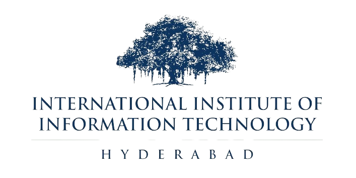</td>
<td><b>Research Intern</b> · IIIT Hyderabad · Dec 2024 – Jun 2025 Layout-preserving document translation: ViT layout detection at 92%, character-metric font detection, K-means colour palettes at 88%. FastAPI + Tesseract OCR for English, Hindi, Telugu, and German, keeping source fonts, colours, and page structure. Live demo at the IIIT Hyderabad research expo (May 2025). <a href="https://youtu.be/rcvSuBcBjyg">Demo</a></td>
</tr>
<tr>
<td>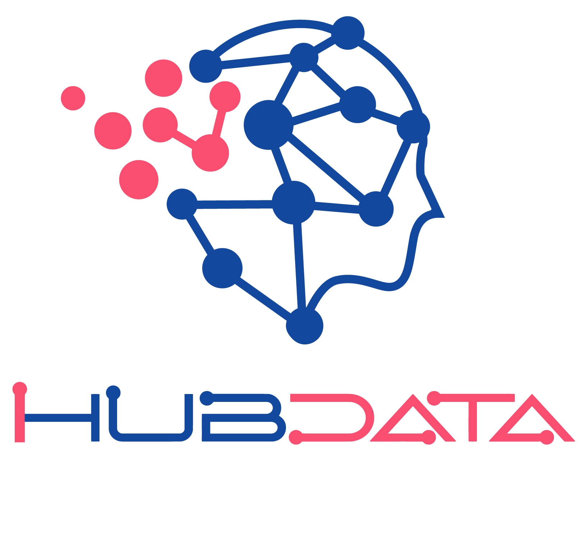</td>
<td><b>AI &amp; ML Research Trainee</b> · iHub-Data, IIIT Hyderabad · May – Oct 2024 Six-month faculty-mentored programme: architecture design, LLM fundamentals, prompting, fine-tuning, quantisation, and deployment. OCR and document-vision methods later reused in the layout-translation project.</td>
</tr>
</table>

---

## Industry experience

<table>
<tr>
<td width="44"></td>
<td><b>AI Integration Engineer</b> · InfoAjax Consulting · Oct – Nov 2025 Integration layer between enterprise apps and cybersecurity services; Azure OpenAI agents for schema mapping; Android and Apple enterprise apps to Azure; Azure-to-Salesforce proofs of concept; React 18 + FastAPI + WebSocket live monitoring; Azure AD via Microsoft Graph. Prototyped a screenshot-driven click/type agent (POC only; not reliable in real time).</td>
</tr>
<tr>
<td></td>
<td><b>WSO2 API Developer</b> · InfoAjax Consulting · Oct 2024 – Jun 2025 Production REST ticketing APIs for PLDT (Philippines telecom) in WSO2 Integration Studio; GitLab vault secrets; Choreo hosting under SLA.</td>
</tr>
<tr>
<td>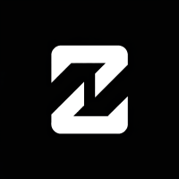</td>
<td><b>Founder &amp; CEO</b> · Zynthetix · Mar 2024 – Jan 2025 Designed a privacy-preserving synthetic-data architecture: a parent model coordinates hundreds of specialised child models to generate tabular, image, and text data without duplication. The same non-redundancy idea became Prism Tuning.</td>
</tr>
</table>

---

## Leadership

**Technical Lead** · Student Activity Council, KL University · 2023–2025 · SAC Momentum Award

Mentored 20+ juniors in web development and ML; ran technical workshops for 100+ students; coordinated 15+ technical events.

---

## Stack

| Area | Tools |
|:---|:---|
| Primary | Python · PyTorch · NumPy (own autograd) · Hugging Face Transformers · TRL · PEFT / LoRA · FastAPI · Docker · Git |
| Research focus | LLMs · GQA, RoPE, SwiGLU, RMSNorm, KV-cache · byte-level BPE · tool-calling SFT · generative models (GANs, VAEs, DDPM) · GNNs · RAG · model compression (LoRA, quantisation, pruning, BIE) · on-device Core ML |
| Vision and documents | EfficientNet · Vision Transformers · CLIP · OpenCV · Tesseract OCR · deepfake / artifact detection (Sobel / FFT) · layout, font and colour-palette extraction |
| Also use | TensorFlow · Keras · LangChain · LlamaIndex · scikit-learn · pandas · React 18 · Next.js · TypeScript · Swift / SwiftUI · React Native · TailwindCSS |
| Cloud and data | AWS (EC2, S3, Lambda) · Azure (AD, OpenAI, Graph) · GCP · OCI · RunPod · WSO2 · Kubernetes · CI/CD · PostgreSQL · MySQL · MongoDB · Redis · FAISS · Supabase |
| Integration | WSO2 Integration Studio · Micro Integrator · Choreo · Microsoft Graph · Salesforce · Automation Anywhere |
| Languages | Python · TypeScript / JavaScript · Java · C · C++ · SQL · Swift · Shell · R |

---

## Education

MSc Computing (Artificial Intelligence and Machine Learning), Imperial College London · Sep 2026 – Sep 2027 *(incoming)*

B.Tech, Computer Science and Engineering, KL University, Hyderabad · Aug 2021 – May 2025 · CGPA 9.72 / 10

IELTS Academic overall 7.5 (CEFR C1)

---

## Certifications

20 certificates. Click a card to open the full image.

<table>
  <tr>
    <td align="center" valign="top" width="25%"><a href="certificates/global-challenge-lab-2026.jpg">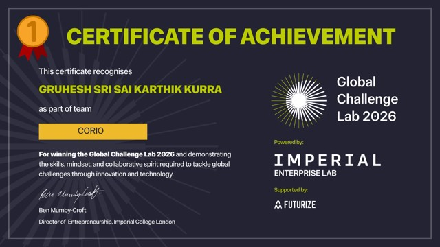</a> Global Challenge Lab 2026 Imperial · 1st place · 2026</td>
    <td align="center" valign="top" width="25%"><a href="certificates/tensorflow-developer.jpg">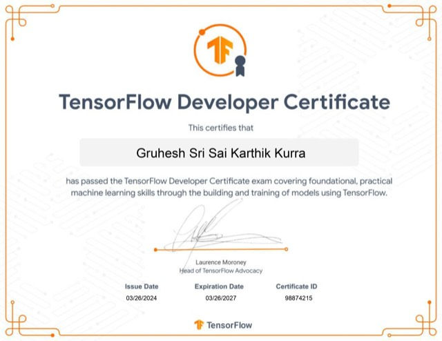</a> TensorFlow Developer Google · 2024</td>
    <td align="center" valign="top" width="25%"><a href="certificates/aws-solutions-architect.jpg">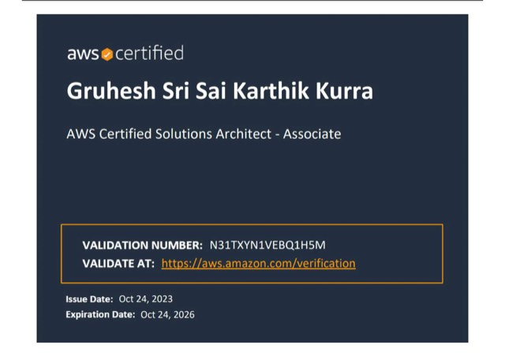</a> Solutions Architect – Associate AWS · 2023</td>
    <td align="center" valign="top" width="25%"><a href="certificates/aws-cloud-practitioner.jpg">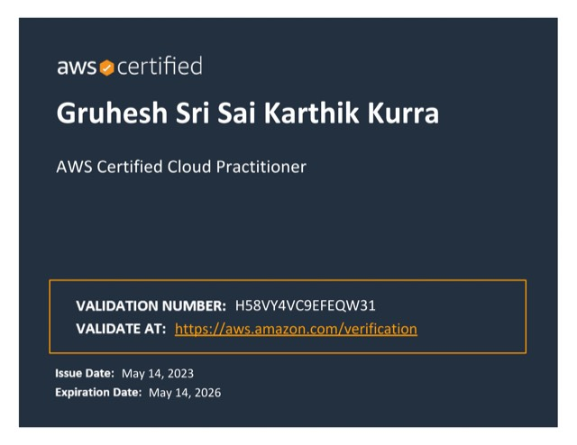</a> Cloud Practitioner AWS · 2023</td>
  </tr>
  <tr>
    <td align="center" valign="top"><a href="certificates/oracle-architect.jpg">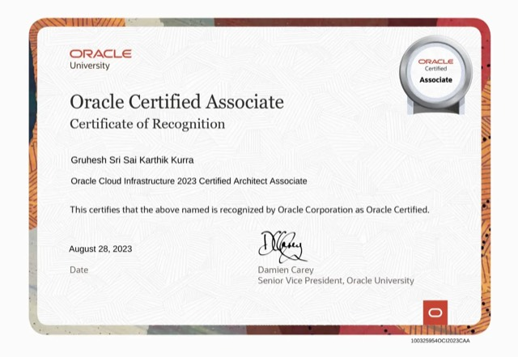</a> OCI Architect Associate Oracle · 2023</td>
    <td align="center" valign="top"><a href="certificates/oracle-genai.jpg">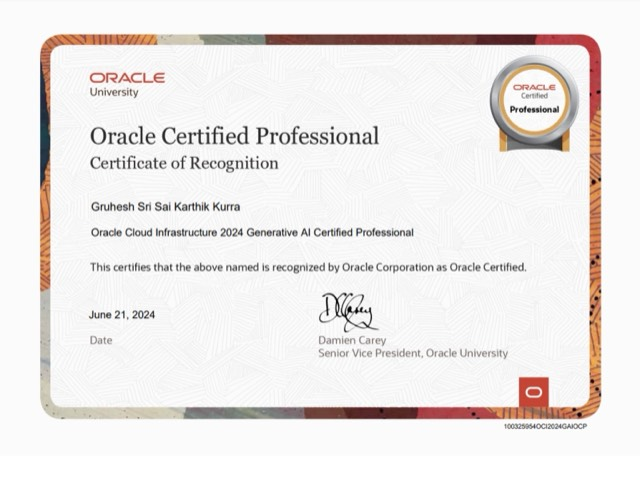</a> OCI Generative AI Professional Oracle · 2024</td>
    <td align="center" valign="top"><a href="certificates/redhat-developer.jpg">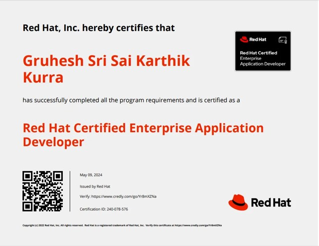</a> Enterprise Application Developer Red Hat · 2024</td>
    <td align="center" valign="top"> Micro Integrator Developer V4 WSO2 · 2025</td>
  </tr>
</table>

More certificates (12)

<table>
  <tr>
    <td align="center" valign="top" width="25%"><a href="certificates/wso2-mi-practitioner.jpg">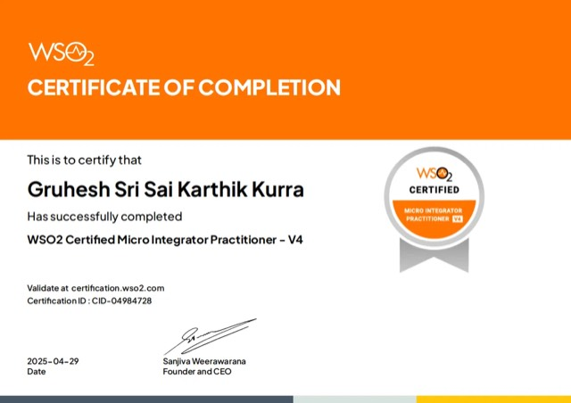</a> Micro Integrator Practitioner V4 WSO2 · 2025</td>
    <td align="center" valign="top" width="25%"><a href="certificates/oracle-database.jpg">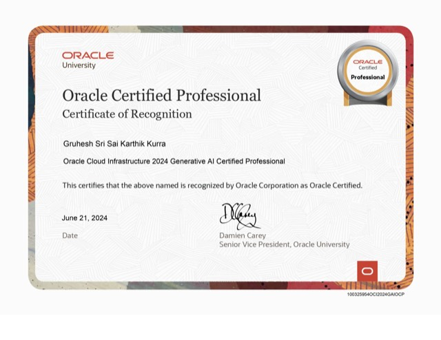</a> Oracle Database Oracle · 2023</td>
    <td align="center" valign="top" width="25%"><a href="certificates/automation-anywhere.jpg">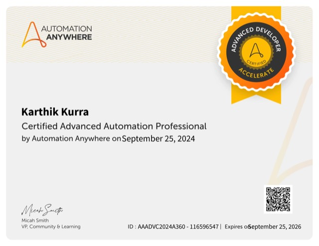</a> Advanced Automation Professional Automation Anywhere · 2024</td>
    <td align="center" valign="top" width="25%"><a href="certificates/iiit-training.jpg">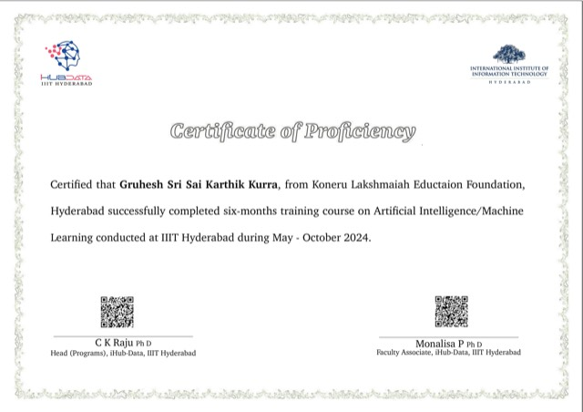</a> 6-Month AI/ML Training IIIT Hyderabad · 2024</td>
  </tr>
  <tr>
    <td align="center" valign="top"><a href="certificates/visuara-llms.jpg">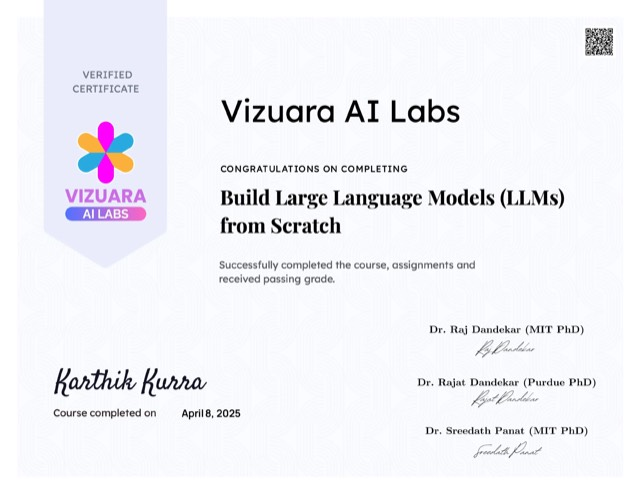</a> Build LLMs From Scratch Visuara · 2024</td>
    <td align="center" valign="top"><a href="certificates/hf-mcp-unit1.jpg">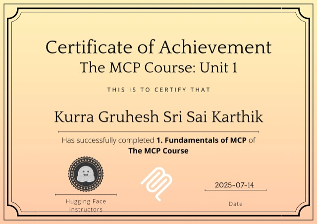</a> MCP Unit 1 Hugging Face · 2024</td>
    <td align="center" valign="top"><a href="certificates/hf-mcp-unit3.jpg">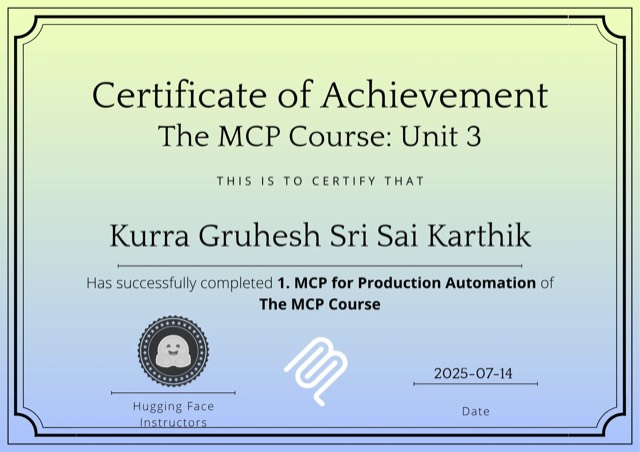</a> MCP Unit 3 Hugging Face · 2024</td>
    <td align="center" valign="top"><a href="certificates/google-gdg.jpg">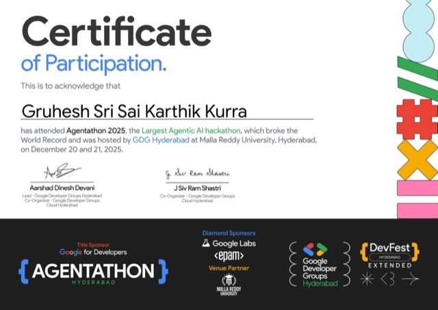</a> Google GDG GDG · 2025</td>
  </tr>
  <tr>
    <td align="center" valign="top"><a href="certificates/udemy-linear-algebra.jpg">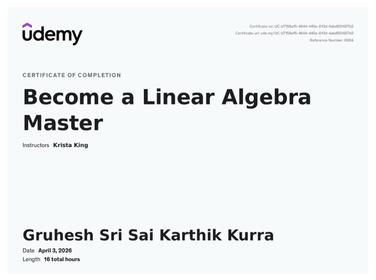</a> Linear Algebra Master Udemy · 2026</td>
    <td align="center" valign="top"><a href="certificates/udemy-deep-learning.jpg">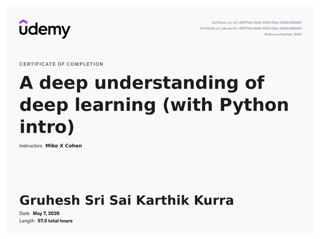</a> Deep Learning with Python Udemy · 2026</td>
    <td align="center" valign="top"><a href="certificates/sac-appreciation.jpg">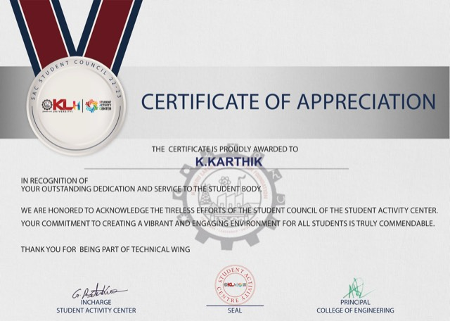</a> SAC Appreciation KL University · 2022–23</td>
    <td align="center" valign="top"><a href="certificates/streetcause.jpg">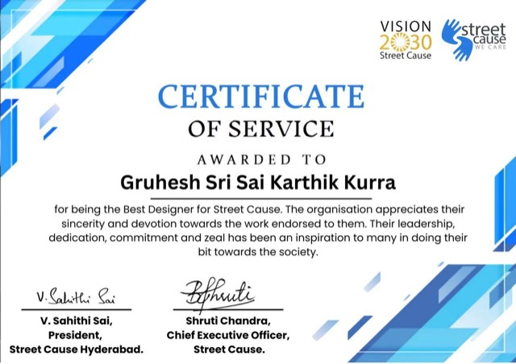</a> Volunteer Street Cause · 2023–24</td>
  </tr>
</table>

---

## Awards

**1st Place, Global Challenge Lab 2026, Imperial College London** · July 2026 · £1,500 team prize

Imperial Enterprise Lab and Futurize's global innovation sprint: 1,000+ students from partner universities worldwide, 14 days, four tracks, one Demo Day. Team Corio (five people: AI/ML ×2, aerospace, physics and mechanical, finance) won with OrbitOps, a vendor-neutral reliability layer for satellite onboard AI:

- Inject radiation-style faults before launch and measure what actually breaks
- Watch the model in orbit with known-answer probes (catches silent degradation that never crashes and never lowers confidence)
- Roll back to a clean copy the moment it breaks

I led the AI/ML work and technical strategy.

**1st Place, University Webathon**, KL University (2022): diet-management platform with personalised meal planning, calorie tracking, and nutritional recommendations, built in a 4-hour hackathon against 50+ teams.

**2nd Place, Design Expo**, KL University (2022–23): Arduino smart switchboard for IoT home automation with real-time energy monitoring and mobile-app control.

**SAC Momentum Award**, Student Activity Council, KL University (2023–25). See [Leadership](#leadership).

---

## GitHub activity

<picture>
  <source media="(prefers-color-scheme: dark)" srcset="https://raw.githubusercontent.com/GruheshKurra/GruheshKurra/output/github-snake-dark.svg">
  <source media="(prefers-color-scheme: light)" srcset="https://raw.githubusercontent.com/GruheshKurra/GruheshKurra/output/github-snake.svg">
  
</picture>

Full stats: activity, languages, contribution calendar, top repositories

  

---

## Contact

[gruheshkurra2@gmail.com](mailto:gruheshkurra2@gmail.com) · [LinkedIn](https://www.linkedin.com/in/gruheshkurra/) · [gruheshkurra.com](https://gruheshkurra.com)

Open to research engineering internships in model training, evaluation, or efficient inference, and to collaboration on transformer research, LLM development, on-device AI, vision-language models, neural compression, and agentic systems.

| Where | Link |
|:---|:---|
| Blog: AI/ML deep dives | [blogs.gruheshkurra.com](https://blogs.gruheshkurra.com) |
| Portfolio | [gruheshkurra.com](https://gruheshkurra.com) |
| Hugging Face | [karthik-2905](https://huggingface.co/karthik-2905) |
| Kaggle | [gruheshkurra](https://www.kaggle.com/gruheshkurra) |
| ORCID | [0009-0002-0558-2882](https://orcid.org/0009-0002-0558-2882) |
| LinkedIn | [gruheshkurra](https://www.linkedin.com/in/gruheshkurra/) |
| X | [@Karthik__kurra](https://x.com/Karthik__kurra) |
| DEV | [dev.to/gruhesh_kurra](https://dev.to/gruhesh_kurra_6eb933146da) |

Also found as Gruhesh Kurra · Karthik Kurra · Gruhesh Sri Sai Karthik · Gruhesh Karthik.
