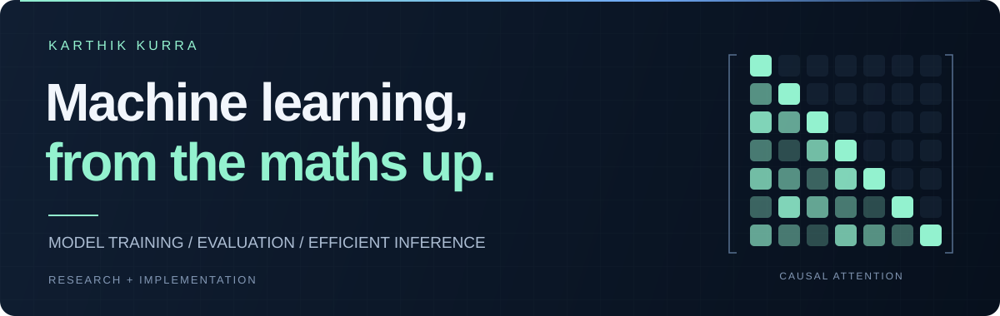

  

<h1 align="center">Gruhesh Sri Sai Karthik Kurra</h1>

  Incoming MSc Computing (AI &amp; ML), Imperial College London 
  First-author research · Language models from scratch · On-device ML

  <a href="https://gruheshkurra.com">Portfolio</a> &nbsp; / &nbsp;
  <a href="https://blogs.gruheshkurra.com">Writing</a> &nbsp; / &nbsp;
  <a href="https://huggingface.co/karthik-2905">Hugging Face</a> &nbsp; / &nbsp;
  <a href="https://www.linkedin.com/in/gruheshkurra/">LinkedIn</a> &nbsp; / &nbsp;
  <a href="mailto:gruheshkurra2@gmail.com">Email</a>

<a href="#selected-work">Selected work</a> &nbsp; · &nbsp; <a href="#research">Research</a> &nbsp; · &nbsp; <a href="#writing">Writing</a> &nbsp; · &nbsp; <a href="#background">Background</a> &nbsp; · &nbsp; <a href="#contact">Contact</a>

---

I build machine learning systems from the maths up: derive the equations, implement the model, then train, evaluate, and work towards on-device inference. My work spans language models, neural weight compression, and deepfake detection.

I’m seeking a research engineering internship in model training, evaluation, or efficient inference. I’m due to start at Imperial in September 2026.

## Selected work

<table>
<tr>
<td width="50%" valign="top">
  01 / LANGUAGE MODELLING
  <h3><a href="https://github.com/GruheshKurra/core-language-model">A language model in pure NumPy</a></h3>
  
3.87M parameters. My own autograd engine.

  
A decoder-only model with RoPE, grouped-query attention, SwiGLU, and a KV-cache. Pretrained on DailyDialog, then fine-tuned on EmpatheticDialogues.

  
78 unit tests across 12 files.

  
<a href="https://github.com/GruheshKurra/core-language-model">Code</a> &nbsp; · &nbsp; <a href="https://huggingface.co/karthik-2905/model-a-scratch">Model</a>

</td>
<td width="50%" valign="top">
  02 / POST-TRAINING
  <h3><a href="https://github.com/GruheshKurra/AL1-model-B">Teaching Qwen3 to call tools</a></h3>
  
Qwen3-0.6B · LoRA · Five tools

  
Supervised fine-tuning on 1,423 tool and chat examples, with assistant-only loss and Hermes-format tool calls.

  
Full-call exact match: 6/12 → 11/12 on a small, greedy evaluation.

  
<a href="https://github.com/GruheshKurra/AL1-model-B">Code</a> &nbsp; · &nbsp; <a href="https://huggingface.co/karthik-2905/AL1-model-B">Model</a>

</td>
</tr>
<tr>
<td width="50%" valign="top">
  03 / NLP RESEARCH
  <h3><a href="https://github.com/GruheshKurra/MANCE-NLP">Morphology-aware embeddings</a></h3>
  
MANCE · IEEE ICCCMLA 2025, accepted

  
Nested character embeddings for word representation. Evaluated on text classification, morphological variants, and named-entity recognition.

  
First-author paper.

  
<a href="https://github.com/GruheshKurra/MANCE-NLP">Code</a> &nbsp; · &nbsp; <a href="https://ieeexplore.ieee.org/document/11580466">Paper</a>

</td>
<td width="50%" valign="top">
  04 / DEEPFAKE FORENSICS
  <h3><a href="https://github.com/GruheshKurra/radar_deepfake">Two streams of visual evidence</a></h3>
  
227,504 frames · Public code and data

  
Sobel boundaries and multi-band FFT features, combined through iterative cross-attention. Includes a checkpoint and leakage self-audit.

  
96.3% AUC on a video-disjoint split; 87.1% on Celeb-DF alone.

  
<a href="https://github.com/GruheshKurra/radar_deepfake">Code</a> &nbsp; · &nbsp; <a href="https://www.kaggle.com/datasets/gruheshkurra/radar-deepfake-frames">Dataset</a>

</td>
</tr>
<tr>
<td width="50%" valign="top">
  05 / ON-DEVICE ML
  <h3><a href="https://github.com/GruheshKurra/Deepguard">DeepGuard for iOS</a></h3>
  
26 MB Core ML model

  
An EfficientNet-B1 deepfake detector trained on an Apple M4 and converted for local inference on iOS.

  
Under 500 ms per image. Trained and converted; not a shipped product.

  
<a href="https://github.com/GruheshKurra/Deepguard">Code</a> &nbsp; · &nbsp; <a href="https://www.youtube.com/watch?v=4MmHJNjLRy4">Demo</a>

</td>
<td width="50%" valign="top">
  06 / MODEL COMPRESSION
  <h3><a href="https://github.com/GruheshKurra/bit-index-encoding-research-">Bit-index encoding</a></h3>
  
BIE · Neural weight compression

  
Bit-index encoding with Numba JIT sparse matrix multiplication. Strongest against baselines above 70% sparsity.

  
Up to 40× compression at reconstruction MSE below 10⁻⁶. Preprint.

  
<a href="https://github.com/GruheshKurra/bit-index-encoding-research-">Code</a> &nbsp; · &nbsp; <a href="https://zenodo.org/records/17217218">Preprint</a>

</td>
</tr>
</table>

Project catalogue and technical details

| Project | What it is | Links |
|:---|:---|:---|
| NumPy language model (AL-1 A) | Decoder-only LM in pure NumPy with a custom autograd engine: **3,869,184** params, 4 layers, d_model 256, GQA (8 query / 2 KV heads), SwiGLU, RoPE, QK-Norm, pre-LN RMSNorm, tied embeddings, 256-token context, KV-cache. Byte-level BPE (4,096 vocab, 3,835 merges). Pretrained on DailyDialog (1.62M training tokens, 2,000 steps) then SFT on 19,375 EmpatheticDialogues conversations with assistant-only loss. 78 unit tests across 12 files | [Code](https://github.com/GruheshKurra/core-language-model) · [HF](https://huggingface.co/karthik-2905/model-a-scratch) |
| Qwen3-0.6B tool-calling (AL-1 B) | LoRA SFT of Qwen3-0.6B (rank 16, α=32, dropout 0.05) with TRL `SFTTrainer` and assistant-only loss on 1,423 examples (945 tool, 478 chat), 3 epochs on a RunPod RTX A6000. Five file-system and shell tools in Hermes format. On n=12 greedy eval: tool-name accuracy 0.50 → 1.00, full-call exact match **0.50 → 0.917 (11/12)** | [Code](https://github.com/GruheshKurra/AL1-model-B) · [HF](https://huggingface.co/karthik-2905/AL1-model-B) |
| MANCE | Nested character embeddings for morphology: +58.3 pp on morphological-variant sentiment (91.67% vs 33.33% Word2Vec); 99.0% DBpedia, 93.5% AG News, 81.3% F1 on GermEval NER | [Code](https://github.com/GruheshKurra/MANCE-NLP) · [IEEE](https://ieeexplore.ieee.org/document/11580466) |
| Dual-Stream Deepfake Detection | Two orthogonal evidence branches (Sobel boundary + multi-band FFT) with iterative cross-attention refinement; trained on **227,504** frames from FaceForensics++, Celeb-DF v2, and WildDeepfake. 96.3% AUC video-disjoint, 87.1% on Celeb-DF alone; code, corpus, audit script and checkpoint all public | [Code + data](https://github.com/GruheshKurra/radar_deepfake) · [Kaggle](https://www.kaggle.com/datasets/gruheshkurra/radar-deepfake-frames) |
| DeepGuard | On-device iOS deepfake detector: EfficientNet-B1 trained on 25k images to 98.62% in 55 minutes on an Apple M4, converted to a 26 MB Core ML model, under 500 ms per image. Trained and converted; not a shipped product | [Code](https://github.com/GruheshKurra/Deepguard) · [Demo](https://www.youtube.com/watch?v=4MmHJNjLRy4) |
| BIE | Bit-index encoding for neural weight compression: up to 40× at reconstruction MSE below 10⁻⁶; Numba JIT sparse matmul, strongest against baselines at sparsity above 70% | [Code](https://github.com/GruheshKurra/bit-index-encoding-research-) · [Zenodo](https://zenodo.org/records/17217218) |
| OrbitOps | Vendor-neutral reliability layer for satellite onboard AI: pre-launch radiation-style fault injection, in-orbit known-answer probes (silent degradation), rollback to a clean copy. Won Global Challenge Lab 2026 with Team Corio | No public repository |
| Hybrid RAG Deepfake | Privacy-first detector: RAG over CLIP embeddings with FAISS, visual inconsistency analysis, and an uncertainty-aware classifier, processed locally; 94.8% accuracy / 94.6% F1 | [Zenodo](https://zenodo.org/records/16732053) |
| GPT-2 / Transformers | GPT-2 (124M) in PyTorch with a BPE tokeniser and full training loop, trained locally (blog post 13 is the walkthrough); encoder-decoder Transformer of *Attention Is All You Need* replicated with BLEU benchmarks | [GPT-2](https://github.com/GruheshKurra/FirstGPTFromScratch) · [Transformers](https://github.com/GruheshKurra/TransformersFromScratch) |
| NL2SQL | Natural language → SQL with attention; perplexity 1.42 | [Code](https://github.com/GruheshKurra/nl2sql-pretrained) |
| Clinical Trial Similarity | PubMedBERT + FAISS retrieval over trial records: 99.5% similarity accuracy (self-reported) | [Code](https://github.com/GruheshKurra/Clinical-Trial-Similarity-Analysis) |
| LLaMA-style training recipe | LLaMA-style decoder (RMSNorm, RoPE, SwiGLU) with a training recipe in PyTorch | [Code](https://github.com/GruheshKurra/LLamaModel) |

**Also:** [AI Voice Assistant for Windows](https://github.com/GruheshKurra/AI-Voice-Assistant-for-Windows) · [WSO2 on Kubernetes](https://github.com/GruheshKurra/WSO2-Kubernetes-Support) · [FarmCare](https://github.com/GruheshKurra/Farmcare) · [healthcareAI](https://github.com/GruheshKurra/healthcareAI) · [NLP / LLM study path](https://github.com/GruheshKurra/awesome-ai-roadmaps)

From-scratch collection: algorithms rebuilt from the math, no library wrappers

**Deep learning and generative models**

| Repo | Topic |
|:---|:---|
| [AttentionMechanisms](https://github.com/GruheshKurra/AttentionMechanisms) | Scaled dot-product and multi-head attention |
| [DiffusionModelFromScratch](https://github.com/GruheshKurra/DiffusionModelFromScratch) | DDPM, forward and reverse process |
| [GAN_Implementation](https://github.com/GruheshKurra/GAN_Implementation) | GAN / DCGAN on MNIST |
| [VariationalAutoencoders](https://github.com/GruheshKurra/VariationalAutoencoders) | VAE, ELBO and latent-space analysis |
| [SequenceModeling](https://github.com/GruheshKurra/SequenceModeling) | RNN, LSTM, GRU |
| [GraphNeuralNetworks-GNN-](https://github.com/GruheshKurra/GraphNeuralNetworks-GNN-) | GCN, GraphSAGE, GAT |

**Reinforcement learning**

| Repo | Topic |
|:---|:---|
| [TemporalDifferenceLearning](https://github.com/GruheshKurra/TemporalDifferenceLearning) | TD(0), SARSA, Q-learning |
| [MonteCarloMethods](https://github.com/GruheshKurra/MonteCarloMethods) | Monte Carlo prediction and control |
| [MarkovsDecisionPlane](https://github.com/GruheshKurra/MarkovsDecisionPlane) | MDPs, value and policy iteration |

**Classical ML**

| Repo | Topic |
|:---|:---|
| [SVM-Implementation-From-Scratch](https://github.com/GruheshKurra/SVM-Implementation-From-Scratch) | Hard margin, soft margin, kernels, multi-class |
| [random-forest-from-scratch](https://github.com/GruheshKurra/random-forest-from-scratch) | Bagging, out-of-bag error, feature importance |
| [decision-trees-from-scratch](https://github.com/GruheshKurra/decision-trees-from-scratch) | CART, entropy and Gini splitting |
| [logistic-regression-impl](https://github.com/GruheshKurra/logistic-regression-impl) · [linear-regression-impl](https://github.com/GruheshKurra/linear-regression-impl) | Gradient descent from first principles |
| [naive-bayes-implementation](https://github.com/GruheshKurra/naive-bayes-implementation) · [knn-implementation](https://github.com/GruheshKurra/knn-implementation) | Gaussian / multinomial NB, instance-based learning |
| [Bayesian-Networks](https://github.com/GruheshKurra/Bayesian-Networks) · [AnomalyDetection](https://github.com/GruheshKurra/AnomalyDetection) | Probabilistic graphical models, outlier detection |

**Clustering and dimensionality reduction**

| Repo | Topic |
|:---|:---|
| [k-means-clustering](https://github.com/GruheshKurra/k-means-clustering) · [dbscan-clustering](https://github.com/GruheshKurra/dbscan-clustering) · [hierarchical-clustering](https://github.com/GruheshKurra/hierarchical-clustering) | Full clustering suite |
| [tsne-from-scratch](https://github.com/GruheshKurra/tsne-from-scratch) · [umap-dimensionality-reduction](https://github.com/GruheshKurra/umap-dimensionality-reduction) · [dimensionality-reduction](https://github.com/GruheshKurra/dimensionality-reduction) | PCA, t-SNE, UMAP |

## Research

My research covers morphology-aware word representations, neural weight compression, and deepfake forensics.

- [MANCE](https://ieeexplore.ieee.org/document/11580466): first-author paper accepted at IEEE ICCCMLA 2025.
- Prism Tuning and [Dual-Stream](https://github.com/GruheshKurra/radar_deepfake): submitted to IEEE NEPCON 2026; under review as recorded in September 2026.
- [BIE](https://zenodo.org/records/17217218) and [Hybrid RAG Deepfake Detection](https://zenodo.org/records/16732053): open preprints, not peer-reviewed.

Publication record, co-authors, and research scope

ORCID [0009-0002-0558-2882](https://orcid.org/0009-0002-0558-2882)

**Accepted**

| Paper | Venue | Year |
|:---|:---|:---|
| [Morphology-Aware Nested Character Embeddings for Word Representation (MANCE)](https://ieeexplore.ieee.org/document/11580466) Gruhesh Sri Sai Karthik Kurra, Chandanasree Moparthi, Prathipati Manish Chowdary, Pavan Kumar Pagadala | IEEE ICCCMLA | 2025 |

**Under review** (none of these are accepted or published)

| Paper | Status | Year |
|:---|:---|:---|
| Prism Tuning: Repulsion-Trained Seed Embeddings in a Frozen Transformer for Non-Redundant Generation Gruhesh Sri Sai Karthik Kurra, Pavan Kumar Pagadala, Malathy Batumalay, Sushma Reddy Koduru | Under review, IEEE NEPCON 2026. Architecture and formulation paper; no empirical results claimed | 2026 |
| [Dual-Stream Artifact Detection with Iterative Evidence Refinement for Frame-Level Deepfake Recognition](https://github.com/GruheshKurra/radar_deepfake) Gruhesh Sri Sai Karthik Kurra, Pavan Kumar Pagadala, Malathy Batumalay, Veda Boddapati | Under review, IEEE NEPCON 2026. Code, 227,504-frame corpus and leakage self-audit released | 2026 |

**Preprints** (open research with DOI, not peer-reviewed)

| Paper | Venue | Year |
|:---|:---|:---|
| [BIE: Bit-Index Encoding for Efficient Neural Network Weight Compression](https://zenodo.org/records/17217218) Gruhesh Sri Sai Karthik Kurra | Zenodo · DOI 10.5281/zenodo.17217218 | 2025 |
| [Hybrid RAG-Enhanced Deepfake Detection: Combining Retrieval-Augmented Generation with Visual Inconsistency Analysis](https://zenodo.org/records/16732053) Gruhesh Sri Sai Karthik Kurra | Zenodo | 2024 |
| RADAR: Reasoning-Augmented Deepfake Artifact Recognition via Multi-Branch Evidence Aggregation Gruhesh Sri Sai Karthik Kurra | Preprint: three branches (skin texture, boundary aliasing, AI-generation fingerprints) into an iterative cross-attention module (R-Former). Architecture and evaluation protocol only; empirical results are in the Dual-Stream companion | 2026 |

**Journal articles (IJNRD)**

| Paper | Venue | Year |
|:---|:---|:---|
| Voice-Activated AI for Seamless Computer Interaction | IJNRD | Jan 2025 |
| Global Remote RAM Sharing: A Novel Framework for Distributed Computational Systems | IJNRD | Dec 2024 |
| Dynamic Auto-Finetuning of Language Models Based on Confidence-Driven Knowledge Integration | IJNRD | Nov 2024 |

## Writing

I write [AI from Scratch](https://blogs.gruheshkurra.com/series/ai/): 15 posts from linear algebra to a working GPT-2 and a NumPy language model. Derive the equations by hand, work a numeric example, then implement it.

| Start with the maths | Build the machinery | Train a language model |
|:---|:---|:---|
| [Visual linear algebra](https://blogs.gruheshkurra.com/blog/essence-of-linear-algebra/) | [Build an autograd engine](https://blogs.gruheshkurra.com/blog/build-autograd-from-scratch/) | [GPT-2 in PyTorch](https://blogs.gruheshkurra.com/blog/build-gpt2-from-scratch/) |
| [Attention, step by step](https://blogs.gruheshkurra.com/blog/attention-in-transformers-explained/) | [Build a BPE tokeniser](https://blogs.gruheshkurra.com/blog/byte-pair-encoding-from-scratch/) | [A mini LLM in NumPy](https://blogs.gruheshkurra.com/blog/build-mini-llm-numpy-from-scratch/) |

Read the full 15-post series

| # | Post | Topic |
|:--|:---|:---|
| 1 | [Linear Algebra for Machine Learning: The Visual Intuition](https://blogs.gruheshkurra.com/blog/essence-of-linear-algebra/) | Vectors, matrices, eigenvectors |
| 2 | [Backpropagation from Scratch: Build an Autograd Engine](https://blogs.gruheshkurra.com/blog/build-autograd-from-scratch/) | Reverse-mode autodiff |
| 3 | [Numerical Gradient Checking: Debug Your Autograd Engine](https://blogs.gruheshkurra.com/blog/numerical-gradient-checking-explained/) | Central differences |
| 4 | [Byte Pair Encoding (BPE) Explained: How GPT Tokenizers Work](https://blogs.gruheshkurra.com/blog/byte-pair-encoding-from-scratch/) | Tokenisation, merge rules |
| 5 | [Token Embeddings Explained: How LLMs Turn IDs Into Vectors](https://blogs.gruheshkurra.com/blog/token-embeddings-explained/) | Embedding matrix, gather vs one-hot |
| 6 | [Positional Encoding Explained: How Transformers Learn Order](https://blogs.gruheshkurra.com/blog/positional-encoding-explained/) | Learned vs sinusoidal |
| 7 | [Cross-Entropy Loss Explained: From Logits to LLM Training](https://blogs.gruheshkurra.com/blog/cross-entropy-loss-explained/) | Softmax and NLL |
| 8 | [Adam and AdamW Explained: How LLMs Update Their Weights](https://blogs.gruheshkurra.com/blog/adam-optimizer-explained/) | Momentum, RMSprop, decoupled decay |
| 9 | [How GPT Actually Works: A Visual Guide to Transformers](https://blogs.gruheshkurra.com/blog/what-is-a-gpt-visual-intro/) | Plain-English transformer tour |
| 10 | [How Attention Works in Transformers: Queries, Keys, Values](https://blogs.gruheshkurra.com/blog/attention-in-transformers-explained/) | Attention pattern, multi-head |
| 11 | [Transformer from Scratch: Forward Pass and Backprop by Hand](https://blogs.gruheshkurra.com/blog/transformer-from-scratch-forward-backward-math/) | One training step, fully worked |
| 12 | [GPT Math Explained: The Full Forward Pass Beyond Attention](https://blogs.gruheshkurra.com/blog/gpt-math-beyond-attention/) | Token IDs → loss → AdamW |
| 13 | [Build GPT-2 from Scratch in PyTorch: A Full Walkthrough](https://blogs.gruheshkurra.com/blog/build-gpt2-from-scratch/) | 124M params, trained locally |
| 14 | [DeepSeek V4 Explained: Long-Context Engineering and Math](https://blogs.gruheshkurra.com/blog/deepseek-v4-engineering-explained/) | Sparse attention, KV-cache scaling |
| 15 | [Build a Mini LLM from Scratch in NumPy: RoPE, GQA, SwiGLU](https://blogs.gruheshkurra.com/blog/build-mini-llm-numpy-from-scratch/) | 3.87M-param chat model, pure NumPy |

[All posts](https://blogs.gruheshkurra.com/ai-explanations/) · [Series](https://blogs.gruheshkurra.com/series/ai/) · [Topics](https://blogs.gruheshkurra.com/tags/) · [Library](https://blogs.gruheshkurra.com/library/) · [RSS](https://blogs.gruheshkurra.com/feed.xml)

Latest posts · updated automatically

<!-- BLOG-POST-LIST:START --><a href="https://blogs.gruheshkurra.com/blog/deepseek-v4-inside-one-token/">DeepSeek V4 Inside: One Token Through Every Block</a> <a href="https://blogs.gruheshkurra.com/blog/looped-transformers-explained/">Looped Transformers Explained: Recurrent Depth and Astra</a> <a href="https://blogs.gruheshkurra.com/blog/natural-language-inference-explained/">Natural Language Inference Explained: Entailment in NLP</a> <a href="https://blogs.gruheshkurra.com/blog/build-mini-llm-numpy-from-scratch/">Build a Mini LLM from Scratch in NumPy: RoPE, GQA, SwiGLU</a> <a href="https://blogs.gruheshkurra.com/blog/gpt-math-beyond-attention/">GPT Math Explained: The Full Forward Pass Beyond Attention</a> <!-- BLOG-POST-LIST:END -->

## Background

<table>
<tr>
<td width="50%" valign="top">
  EDUCATION
  <h3>Imperial College London</h3>
  
Incoming MSc Computing Artificial Intelligence and Machine Learning September 2026 – September 2027

  
B.Tech Computer Science and Engineering KL University, Hyderabad · 2021–2025 CGPA 9.72 / 10

</td>
<td width="50%" valign="top">
  GLOBAL CHALLENGE LAB 2026
  <h3>1st place with Team Corio</h3>
  
I led AI/ML and technical strategy for OrbitOps, a reliability layer for satellite onboard AI.

  
Pre-launch fault injection, in-orbit probes, and rollback to a clean copy. Imperial College London · £1,500 team prize

</td>
</tr>
</table>

<table>
<tr>
<td width="44"></td>
<td><b>Research Intern</b> · IIIT Hyderabad · Dec 2024 – Jun 2025 Layout-preserving document translation: ViT layout detection at 92%, character-metric font detection, K-means colour palettes at 88%. FastAPI + Tesseract OCR for English, Hindi, Telugu, and German, keeping source fonts, colours, and page structure. Live demo at the IIIT Hyderabad research expo (May 2025). <a href="https://youtu.be/rcvSuBcBjyg">Demo</a></td>
</tr>
<tr>
<td></td>
<td><b>AI &amp; ML Research Trainee</b> · iHub-Data, IIIT Hyderabad · May – Oct 2024 Six-month faculty-mentored programme: architecture design, LLM fundamentals, prompting, fine-tuning, quantisation, and deployment. OCR and document-vision methods later reused in the layout-translation project.</td>
</tr>
</table>

Industry experience and leadership

<table>
<tr>
<td width="44"></td>
<td><b>AI Integration Engineer</b> · InfoAjax Consulting · Oct – Nov 2025 Integration layer between enterprise apps and cybersecurity services; Azure OpenAI agents for schema mapping; Android and Apple enterprise apps to Azure; Azure-to-Salesforce proofs of concept; React 18 + FastAPI + WebSocket live monitoring; Azure AD via Microsoft Graph. Prototyped a screenshot-driven click/type agent (POC only; not reliable in real time).</td>
</tr>
<tr>
<td></td>
<td><b>WSO2 API Developer</b> · InfoAjax Consulting · Oct 2024 – Jun 2025 Production REST ticketing APIs for PLDT (Philippines telecom) in WSO2 Integration Studio; GitLab vault secrets; Choreo hosting under SLA.</td>
</tr>
<tr>
<td></td>
<td><b>Founder &amp; CEO</b> · Zynthetix · Mar 2024 – Jan 2025 Designed a privacy-preserving synthetic-data architecture: a parent model coordinates hundreds of specialised child models to generate tabular, image, and text data without duplication. The same non-redundancy idea became Prism Tuning.</td>
</tr>
</table>

**Technical Lead** · Student Activity Council, KL University · 2023–2025 · SAC Momentum Award

Mentored 20+ juniors in web development and ML; ran technical workshops for 100+ students; coordinated 15+ technical events.

Awards and qualifications

**1st Place, Global Challenge Lab 2026, Imperial College London** · July 2026 · £1,500 team prize

Imperial Enterprise Lab and Futurize's global innovation sprint: 1,000+ students from partner universities worldwide, 14 days, four tracks, one Demo Day. Team Corio (five people: AI/ML ×2, aerospace, physics and mechanical, finance) won with OrbitOps, a vendor-neutral reliability layer for satellite onboard AI:

- Inject radiation-style faults before launch and measure what breaks
- Watch the model in orbit with known-answer probes (catches silent degradation that never crashes and never lowers confidence)
- Roll back to a clean copy the moment it breaks

I led the AI/ML work and technical strategy.

**1st Place, University Webathon**, KL University (2022): diet-management platform with personalised meal planning, calorie tracking, and nutritional recommendations, built in a 4-hour hackathon against 50+ teams.

**2nd Place, Design Expo**, KL University (2022–23): Arduino smart switchboard for IoT home automation with real-time energy monitoring and mobile-app control.

**SAC Momentum Award**, Student Activity Council, KL University (2023–25).

IELTS Academic: 7.5 overall (CEFR C1).

20 certificates · cloud, ML, integration, and community

Each link opens the original certificate image. Dates below are the recorded award years.

| Certificate | Issuer / year |
|:---|:---|
| [Global Challenge Lab 2026](certificates/global-challenge-lab-2026.jpg) | Imperial · 1st place · 2026 |
| [TensorFlow Developer](certificates/tensorflow-developer.jpg) | Google · 2024 |
| [Solutions Architect · Associate](certificates/aws-solutions-architect.jpg) | AWS · 2023 |
| [Cloud Practitioner](certificates/aws-cloud-practitioner.jpg) | AWS · 2023 |
| [OCI Architect Associate](certificates/oracle-architect.jpg) | Oracle · 2023 |
| [OCI Generative AI Professional](certificates/oracle-genai.jpg) | Oracle · 2024 |
| [Enterprise Application Developer](certificates/redhat-developer.jpg) | Red Hat · 2024 |
| [Micro Integrator Developer V4](certificates/wso2-mi-developer.jpg) | WSO2 · 2025 |
| [Micro Integrator Practitioner V4](certificates/wso2-mi-practitioner.jpg) | WSO2 · 2025 |
| [Oracle Database](certificates/oracle-database.jpg) | Oracle · 2023 |
| [Advanced Automation Professional](certificates/automation-anywhere.jpg) | Automation Anywhere · 2024 |
| [6-Month AI/ML Training](certificates/iiit-training.jpg) | IIIT Hyderabad · 2024 |
| [Build LLMs From Scratch](certificates/visuara-llms.jpg) | Visuara · 2024 |
| [MCP Unit 1](certificates/hf-mcp-unit1.jpg) | Hugging Face · 2024 |
| [MCP Unit 3](certificates/hf-mcp-unit3.jpg) | Hugging Face · 2024 |
| [Google GDG](certificates/google-gdg.jpg) | GDG · 2025 |
| [Linear Algebra Master](certificates/udemy-linear-algebra.jpg) | Udemy · 2026 |
| [Deep Learning with Python](certificates/udemy-deep-learning.jpg) | Udemy · 2026 |
| [SAC Appreciation](certificates/sac-appreciation.jpg) | KL University · 2022–23 |
| [Volunteer](certificates/streetcause.jpg) | Street Cause · 2023–24 |

## Toolkit

`Python` `PyTorch` `NumPy` `Transformers` `TRL` `PEFT / LoRA` `FastAPI` `Docker` `Git`

I use these across model training, evaluation, and inference. For vision and on-device work: OpenCV, Vision Transformers, CLIP, and Core ML.

Full stack by area

| Area | Tools |
|:---|:---|
| Primary | Python · PyTorch · NumPy (own autograd) · Hugging Face Transformers · TRL · PEFT / LoRA · FastAPI · Docker · Git |
| Research focus | LLMs · GQA, RoPE, SwiGLU, RMSNorm, KV-cache · byte-level BPE · tool-calling SFT · generative models (GANs, VAEs, DDPM) · GNNs · RAG · model compression (LoRA, quantisation, pruning, BIE) · on-device Core ML |
| Vision and documents | EfficientNet · Vision Transformers · CLIP · OpenCV · Tesseract OCR · deepfake / artifact detection (Sobel / FFT) · layout, font and colour-palette extraction |
| Also use | TensorFlow · Keras · LangChain · LlamaIndex · scikit-learn · pandas · React 18 · Next.js · TypeScript · Swift / SwiftUI · React Native · TailwindCSS |
| Cloud and data | AWS (EC2, S3, Lambda) · Azure (AD, OpenAI, Graph) · GCP · OCI · RunPod · WSO2 · Kubernetes · CI/CD · PostgreSQL · MySQL · MongoDB · Redis · FAISS · Supabase |
| Integration | WSO2 Integration Studio · Micro Integrator · Choreo · Microsoft Graph · Salesforce · Automation Anywhere |
| Languages | Python · TypeScript / JavaScript · Java · C · C++ · SQL · Swift · Shell · R |

GitHub activity and contribution graph

<picture>
  <source media="(prefers-color-scheme: dark)" srcset="https://raw.githubusercontent.com/GruheshKurra/GruheshKurra/output/github-snake-dark.svg">
  <source media="(prefers-color-scheme: light)" srcset="https://raw.githubusercontent.com/GruheshKurra/GruheshKurra/output/github-snake.svg">
  
</picture>

Full stats: activity, languages, contribution calendar, top repositories

  

## Contact

For research engineering internships or collaboration on language models, compression, and on-device inference:

[gruheshkurra2@gmail.com](mailto:gruheshkurra2@gmail.com) &nbsp; · &nbsp; [LinkedIn](https://www.linkedin.com/in/gruheshkurra/) &nbsp; · &nbsp; [Portfolio](https://gruheshkurra.com)

[Hugging Face](https://huggingface.co/karthik-2905) · [Kaggle](https://www.kaggle.com/gruheshkurra) · [ORCID](https://orcid.org/0009-0002-0558-2882) · [X](https://x.com/Karthik__kurra) · [DEV](https://dev.to/gruhesh_kurra_6eb933146da) · [RSS](https://blogs.gruheshkurra.com/feed.xml)

Also found as Gruhesh Kurra · Karthik Kurra · Gruhesh Sri Sai Karthik · Gruhesh Karthik.
