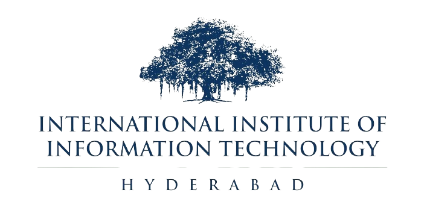
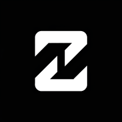
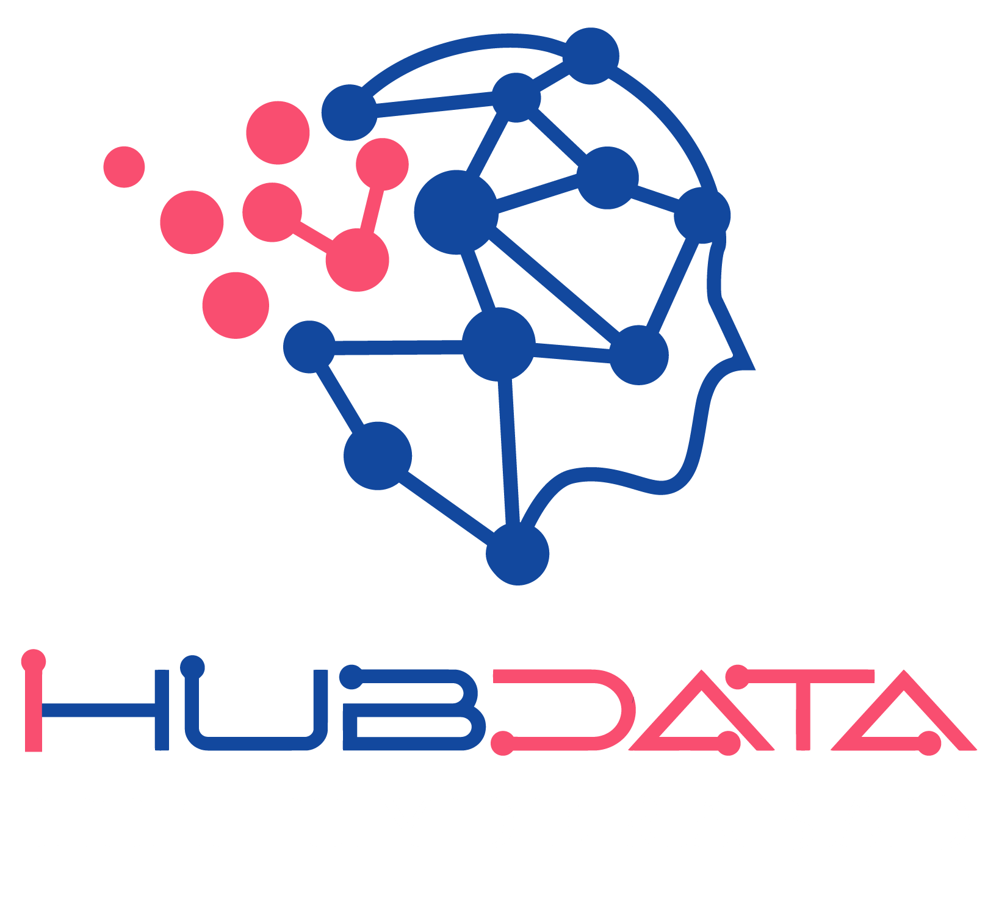

 

&nbsp;&nbsp;&nbsp;&nbsp;&nbsp;

 

<table>
<tr>
<td width="62%" valign="top">

### About me

I build machine learning models from the maths up: derive the equations, write the code, train the model, and check what it learned.

I'm **Gruhesh Sri Sai Karthik Kurra**, based in London and enrolled in the **MSc Computing (Artificial Intelligence and Machine Learning) at Imperial College London** for 2026–2027. My work spans language models, representation learning, deepfake detection, and efficient inference.

I'm looking for **research engineering and ML internships** in model training, evaluation, and inference.

</td>
<td width="38%" valign="top">

### At a glance

- **Now:** MSc AI & ML, Imperial
- **Based in:** London, UK
- **Focus:** LMs · forensics · inference
- **Seeking:** research engineering and ML internships
- **B.Tech:** CGPA 9.72 / 10

</td>
</tr>
</table>

 

## Selected projects

<table>
<tr>
<td width="50%" valign="top">

### [A language model in pure NumPy](https://github.com/GruheshKurra/core-language-model)

  

A **3.87M-parameter** decoder-only transformer with my own automatic differentiation engine and byte-pair encoding tokeniser. I implemented grouped-query attention, rotary position embeddings, SwiGLU, QK-Norm, and a key-value cache, then pretrained on DailyDialog and fine-tuned on 19,375 EmpatheticDialogues conversations. The repository includes 78 unit tests for the gradients, model, tokeniser, and training code.

[Model weights](https://huggingface.co/karthik-2905/model-a-scratch) · [Build walkthrough](https://blogs.gruheshkurra.com/blog/build-mini-llm-numpy-from-scratch/)

</td>
<td width="50%" valign="top">

### [Teaching Qwen3-0.6B to call tools](https://github.com/GruheshKurra/AL1-model-B)

  

A LoRA fine-tune using TRL, assistant-only loss, and 1,423 tool and chat examples. The model learns five file and shell tools in Hermes format. Full tool-call exact match rose from **6/12 to 11/12** on a small, 12-case greedy evaluation against the base model.

[LoRA adapter](https://huggingface.co/karthik-2905/AL1-model-B)

</td>
</tr>
<tr>
<td width="50%" valign="top">

### [Dual-Stream deepfake detection](https://github.com/GruheshKurra/radar_deepfake)

  

A Sobel-edge boundary stream and a multi-band Fourier frequency stream, combined through iterative cross-attention. I trained on 227,504 frames from FaceForensics++, Celeb-DF v2, and WildDeepfake. After auditing source-video overlap, the model reached **96.3% AUC** on a 5,680-frame video-disjoint subset and **87.1% AUC** on Celeb-DF. These results come from one training run.

[Frame dataset](https://www.kaggle.com/datasets/gruheshkurra/radar-deepfake-frames)

</td>
<td width="50%" valign="top">

### [MANCE: morphology-aware word embeddings](https://github.com/GruheshKurra/MANCE-NLP)

 

Word representations built from nested character sequences, so related word forms can share information. The work explores recurrent, convolutional, and Transformer encoders for classification and named entity recognition. **First-author paper accepted at IEEE ICCCMLA 2025.**

[Paper on IEEE Xplore](https://ieeexplore.ieee.org/document/11580466)

</td>
</tr>
<tr>
<td width="50%" valign="top">

### [DeepGuard: a deepfake model for on-device use](https://github.com/GruheshKurra/Deepguard)

 

An EfficientNet-B1 classifier trained on 25,000 images using Apple Silicon and converted to a **26 MB Core ML model** for iOS inference. This project covers model training and conversion; an end-user app has not shipped.

[Demo](https://www.youtube.com/watch?v=4MmHJNjLRy4)

</td>
<td width="50%" valign="top">

### [Bit-Index Encoding](https://github.com/GruheshKurra/bit-index-encoding-research-)

 

Experiments in compressing sparse neural-network weights by storing nonzero bit positions. Includes Numba sparse matrix multiplication kernels and benchmarks for computing with the compressed representation.

[Preprint on Zenodo](https://zenodo.org/records/17217218)

</td>
</tr>
</table>

## Research

I work on word representation, model compression, and the evidence used by detection systems.

| Paper | Status |
| :-- | :-- |
| [Morphology-Aware Nested Character Embeddings for Word Representation](https://ieeexplore.ieee.org/document/11580466) |  |
| [Dual-Stream Artifact Detection with Iterative Evidence Refinement for Frame-Level Deepfake Recognition](https://github.com/GruheshKurra/radar_deepfake) |  |
| Prism Tuning: Repulsion-Trained Seed Embeddings in a Frozen Transformer for Non-Redundant Generation |  Method paper; empirical evaluation pending |
| [BIE: Bit-Index Encoding for Efficient Neural Network Weight Compression](https://zenodo.org/records/17217218) |  |
| [Hybrid RAG-Enhanced Deepfake Detection: A Novel Approach Combining Retrieval-Augmented Generation with Visual Inconsistency Analysis](https://zenodo.org/records/16732053) |  Architecture and evaluation plan |
| RADAR: Reasoning-Augmented Deepfake Artifact Recognition via Multi-Branch Evidence Aggregation |  Architecture and evaluation protocol |

Preprints have not been peer reviewed. Prism Tuning, Hybrid RAG, and RADAR describe proposed methods; their design targets are not measured model results.

## Experience

<table>
<tr>
<td width="72" align="center" valign="top"></td>
<td valign="top">

**AI Integration Engineer** · InfoAjax Consulting · Oct–Nov 2025 
Built enterprise and cybersecurity integrations using Azure OpenAI agents for schema mapping. Delivered Azure-to-Salesforce proofs of concept and a React, FastAPI, and WebSocket console for live agent monitoring.

</td>
</tr>
<tr>
<td width="72" align="center" valign="top"></td>
<td valign="top">

**Research Intern** · IIIT Hyderabad · Dec 2024–Jun 2025 
Built a document translation pipeline that preserves fonts, colours, and page structure using Vision Transformer layout detection, Tesseract OCR, and FastAPI. Supported English, Hindi, Telugu, and German, and presented a live demo at the institute's May 2025 research expo. [Demo](https://youtu.be/rcvSuBcBjyg)

</td>
</tr>
<tr>
<td width="72" align="center" valign="top"></td>
<td valign="top">

**WSO2 API Developer** · InfoAjax Consulting · Oct 2024–Jun 2025 
Shipped REST ticketing APIs for PLDT through WSO2 Integration Studio and Choreo, and supported production integrations under client service-level agreements.

</td>
</tr>
<tr>
<td width="72" align="center" valign="top"></td>
<td valign="top">

**Founder** · Zynthetix · Mar 2024–Jan 2025 
Designed a parent-and-child model architecture for generating synthetic tabular, image, and text data with less duplication. The diversity objective later informed Prism Tuning.

</td>
</tr>
<tr>
<td width="72" align="center" valign="top"></td>
<td valign="top">

**AI and ML Research Trainee** · iHub-Data, IIIT Hyderabad · May–Oct 2024 
Completed a six-month faculty-mentored programme in model architecture, language models, fine-tuning, quantisation, and deployment.

</td>
</tr>
</table>

## Education and awards

<table>
<tr>
<td width="50%" valign="top">

#### Education

**Imperial College London** 
MSc Computing (Artificial Intelligence and Machine Learning) 
Sep 2026–Sep 2027, expected · Enrolled for September 2026

**KL University, Hyderabad** 
B.Tech Computer Science and Engineering 
Aug 2021–May 2025 · CGPA 9.72/10

</td>
<td width="50%" valign="top">

#### Awards

**1st place · Global Challenge Lab 2026** · Imperial, July 2026 
Led AI/ML work and technical strategy for five-person Team Corio. Our project, OrbitOps, proposed a reliability layer for satellite AI using pre-launch fault injection, in-orbit known-answer probes, and rollback. The team won £1,500. [Certificate](certificates/global-challenge-lab-2026.jpg)

**1st place · University Webathon** · KL University, 2022 
Built a diet-management platform in four hours, competing against more than 50 teams.

**2nd place · Design Expo** · KL University, 2022–2023 
Built an Arduino smart switchboard with energy monitoring and app control.

**SAC Momentum Award** · KL University, 2023–2025 
As Student Activity Council Technical Lead, I mentored 20+ juniors, ran workshops for 100+ students, and coordinated 15+ events.

</td>
</tr>
</table>

## Learning in public

I write [**AI from Scratch**](https://blogs.gruheshkurra.com/series/ai/), a series that moves from derivations and hand-worked examples to runnable implementations.

#### Start with

| Post | What it covers |
| :-- | :-- |
| [Build an autograd engine](https://blogs.gruheshkurra.com/blog/build-autograd-from-scratch/) | Automatic differentiation and gradient checks |
| [Attention in Transformers](https://blogs.gruheshkurra.com/blog/attention-in-transformers-explained/) | The attention calculation, step by step |
| [GPT-2 from scratch](https://blogs.gruheshkurra.com/blog/build-gpt2-from-scratch/) | A 124M-parameter architecture in PyTorch |
| [A mini language model in NumPy](https://blogs.gruheshkurra.com/blog/build-mini-llm-numpy-from-scratch/) | Tokenisation, model code, and training |

#### Latest writing

<!-- BLOG-POST-LIST:START --><a href="https://blogs.gruheshkurra.com/blog/convolutional-neural-networks-explained/">Convolutional Neural Networks: CNN Math Explained</a> <a href="https://blogs.gruheshkurra.com/blog/deepseek-v4-inside-one-token/">DeepSeek V4 Inside: One Token Through Every Block</a> <a href="https://blogs.gruheshkurra.com/blog/looped-transformers-explained/">Looped Transformers Explained: Recurrent Depth and Astra</a> <a href="https://blogs.gruheshkurra.com/blog/natural-language-inference-explained/">Natural Language Inference Explained: Entailment in NLP</a> <a href="https://blogs.gruheshkurra.com/blog/build-mini-llm-numpy-from-scratch/">Build a Mini LLM from Scratch in NumPy: RoPE, GQA, SwiGLU</a> <!-- BLOG-POST-LIST:END -->

[All posts](https://blogs.gruheshkurra.com/ai-explanations/) · [RSS](https://blogs.gruheshkurra.com/feed.xml) · [DEV](https://dev.to/gruhesh_kurra_6eb933146da)

<b>From-scratch implementations</b> — notebooks and repositories

 

| Area | Implementations |
| :-- | :-- |
| Language models | [GPT-2](https://github.com/GruheshKurra/FirstGPTFromScratch) · [Encoder-decoder Transformers](https://github.com/GruheshKurra/TransformersFromScratch) · [LLaMA-style decoding](https://github.com/GruheshKurra/LLamaModel) · [Attention](https://github.com/GruheshKurra/AttentionMechanisms) |
| Generative and graph models | [Diffusion](https://github.com/GruheshKurra/DiffusionModelFromScratch) · [GANs](https://github.com/GruheshKurra/GAN_Implementation) · [VAEs](https://github.com/GruheshKurra/VariationalAutoencoders) · [Graph neural networks](https://github.com/GruheshKurra/GraphNeuralNetworks-GNN-) |
| ML foundations | [SVMs](https://github.com/GruheshKurra/SVM-Implementation-From-Scratch) · [Random forests](https://github.com/GruheshKurra/random-forest-from-scratch) · [PCA](https://github.com/GruheshKurra/dimensionality-reduction) · [k-means](https://github.com/GruheshKurra/k-means-clustering) · [Temporal-difference learning](https://github.com/GruheshKurra/TemporalDifferenceLearning) |
| Applied work | [Natural language to SQL](https://github.com/GruheshKurra/nl2sql-pretrained) · [Clinical trial retrieval with PubMedBERT and FAISS](https://github.com/GruheshKurra/Clinical-Trial-Similarity-Analysis) · [WSO2 on Kubernetes](https://github.com/GruheshKurra/WSO2-Kubernetes-Support) · [AI learning roadmaps](https://github.com/GruheshKurra/awesome-ai-roadmaps) |

## Tools I work with

| Area | Tools and methods |
| :-- | :-- |
| Model development | Python, PyTorch, NumPy, TensorFlow, scikit-learn, Hugging Face Transformers |
| Training and efficiency | TRL, PEFT, LoRA, quantisation, pruning, distillation, Numba |
| Vision and retrieval | OpenCV, Vision Transformers, Tesseract, CLIP, FAISS |
| On-device models | Core ML, Swift, Apple Silicon / Metal MPS |
| APIs and applications | FastAPI, React, TypeScript, REST, WebSocket, WSO2 |
| Infrastructure and data | Docker, Kubernetes, Git, AWS, Azure, PostgreSQL, MongoDB, Redis |

**Certificates:** [TensorFlow Developer](certificates/tensorflow-developer.jpg) · [AWS Solutions Architect – Associate](certificates/aws-solutions-architect.jpg) · [OCI Generative AI Professional](certificates/oracle-genai.jpg) · WSO2 Micro Integrator V4 [Developer](certificates/wso2-mi-developer.jpg) and [Practitioner](certificates/wso2-mi-practitioner.jpg) · [All certificates](certificates/)

## GitHub activity

<picture>
  <source media="(prefers-color-scheme: dark)" srcset="https://raw.githubusercontent.com/GruheshKurra/GruheshKurra/output/github-snake-dark.svg" />
  <source media="(prefers-color-scheme: light)" srcset="https://raw.githubusercontent.com/GruheshKurra/GruheshKurra/output/github-snake.svg" />
  
</picture>

<b>Full metrics</b> — languages, topics, repositories and calendar

 

## Let's talk

For research engineering opportunities or collaboration on language models, model compression, and on-device inference, reach me at [gruheshkurra2@gmail.com](mailto:gruheshkurra2@gmail.com) or on [LinkedIn](https://www.linkedin.com/in/gruheshkurra/).

